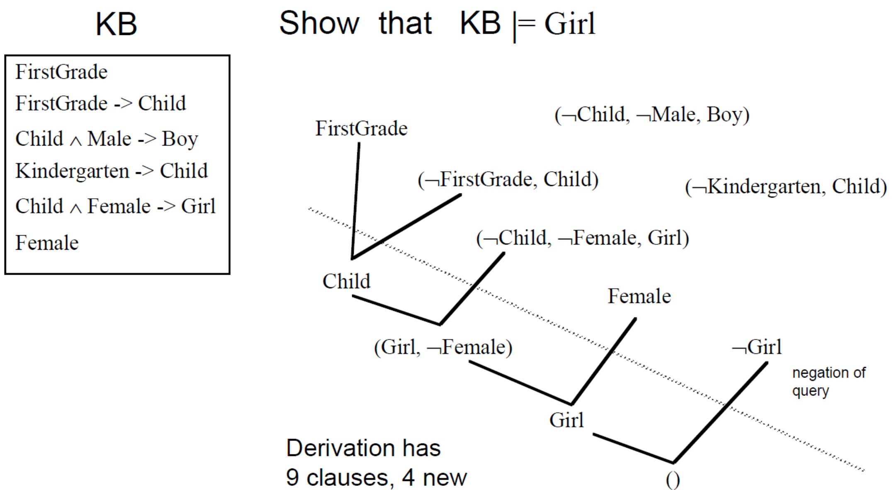
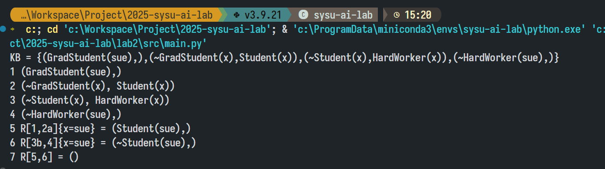
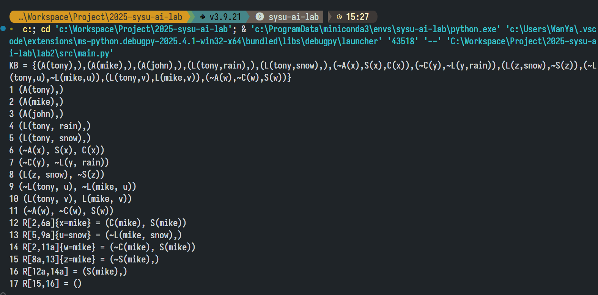
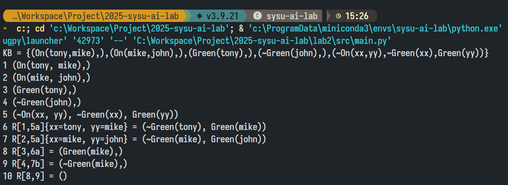
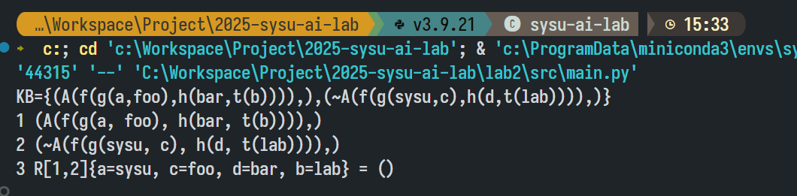
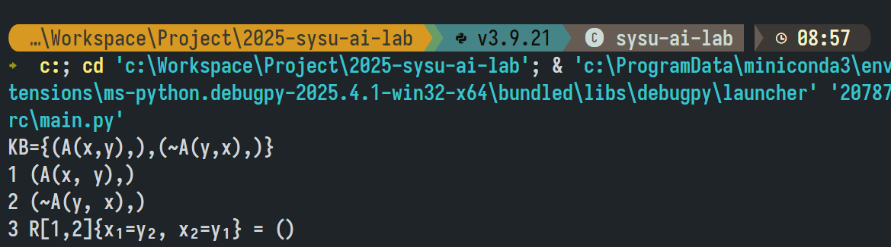
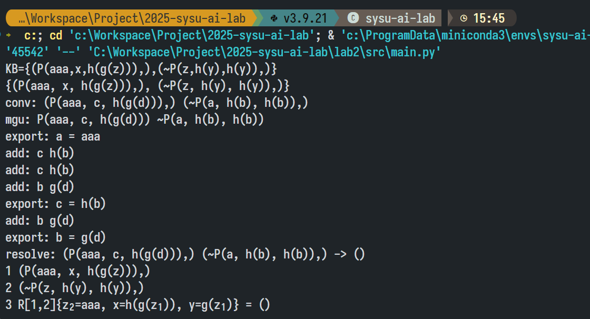
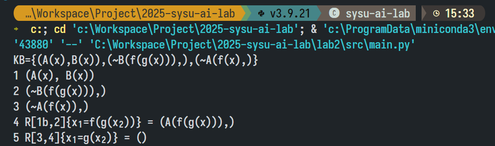

# 人工智能实验报告 实验二 归结原理

姓名：数据删除 学号：数据删除

## 一、实验内容

### 1. 算法原理
本实验旨在实现并应用归结原理，用于命题逻辑和一阶逻辑中的自动定理证明。归结原理的核心思想是通过证明一个陈述 $\alpha$ 的否定，即 $\neg\alpha$，与给定的知识库 ($\text{KB}$) 不一致，来证明 $\alpha$ 的有效性。这通过以下步骤实现：
1. 将 $\alpha$ 取否定，加入到 $\text{KB}$ 当中
2. 将更新的 $\text{KB}$ 转换为 $\text{clausal form}$ 得到新的子句集 $S$
3. 反复调用单步归结
	1. 如果得到空子句，即 $S|-()$，说明$\text{KB} \land\neg\alpha$ 不可满足，算法终止，可得$\text{KB} |= \alpha$
	2. 如果一直归结直到不产生新的子句，在这个过程中没有得到空子句，则 $\text{KB} |=α$ 不成立

其中，归结算法通过以下步骤实现：
1. 从两个子句中分别寻找相同的原子及其对应的原子否定
2. 去掉该原子并将两个子句合为一个，加入到 $S$ 子句集合中，例如 $(\neg\text{child},\neg \text{female},\text{girl})$ 和 $(\text{child})$ 合并为 $(\neg \text{female},\text{girl})$



由于一阶逻辑中存在变量，所以归结之前需要进行合一，如 $(P(\text{john}),Q(\text{fred}),R(x))$ 和 $(¬P(y),R(\text{susan}),R(y))$ 两个子句中，我们无法找到一样的原子及其对应的否定，但是不代表它们不能够归结。通过将 $y$ 替换为 $\text{john}$，我们得到了 $(P(\text{john}),Q(\text{fred}),R(x))$ 和
$(¬P(\text{john}),R(\text{susan}),R(\text{john}))$，此时我们两个子句分别存在原子 $P(\text{john})$ 和它的
否定 $\neg P(\text{john})$，可以进行归结。

上述算法称为最一般合一（$\text{MGU}$）算法，他的过程如下：
* 输入：两个原子公式，它们具有相同的谓词，不同的参数项和 “$\neg$” 
* 输出：一组变量替换/赋值 
* 算法流程:
	1.  $k = 0;\ \sigma_0 = \{\};\ S_0 = \{f,g\}$
	2. 如果 $S_k$ 中的公式等价,返回 $\sigma_k$ 作为最一般合一的结果，否则找出 $S_k$ 中的不匹配项 $D_k= \{e_1,e_2\}$ 
	3.   如果 $e_1=V$ 是变量，$e_2 = t$ 是一个不包含变量 $V$ 的项, 将“$V=t$”添加到赋值集合 $\sigma_{k+1}$ = $\sigma_k∪ {V = t}$ 并将 $S_k$ 中的其它 $V$ 变量也赋值为 $t$, 得到 $S_{k+1}; \ k=k+1$，转到第二步。否则合一失败

因此单步归结的过程为：
1. 使用 $\text{MGU}$ 算法从两个子句中得到相同的原子，及其对应的原子否定
2. 去掉该原子并将两个子句合为一个，加入到 $S$ 子句集合中
### 2. 创新点 & 优化
#### 归结算法子句选择的顺序
为了避免重复选择相同的子句对进行归结，一般的做法可能是：
1. 将所有子句化为字符串并放入一个 set 中
2. 记录所有使用过的字句对组合（化为字符串或者用下标表示），同样放入 set

然而以上两种方法虽然能避免重复归结，但无法避免重复迭代的问题。
考虑优化迭代顺序：以右指针为第一层循环变量，左指针为第二层循环变量，采用下标访问而不是 iterator 访问，防止边迭代边写入的不安全性。这样可以保证在找到新的子句集时，不需要重新开始迭代，同时满足在不使用优先队列的情况下，尽可能使较少步骤能归结出来的子句放在队列的较前方。
#### 输出归结过程时忽略冗余项
并不是每一步单步归结都和最后的过程有关：将归结过程做成有向图，显然是一棵 DAG。因此保存每一步归结来自于哪两步，最后输出时从后往前扫描即可。
#### 队列优化 MGU
完全照抄 $\text{MGU}$ 的理论思路显然不优：每次都要从头开始扫描整个子句集，每次都要产生一个新子句集。
事实上我们只需要得到最终的映射表即可，中间的子句集状态完全不需要保存。因此只需要将需要进行 $\text{MGU}$ 的项对放入队列中，根据项对的特征一步一步往下拆解即可。
优先尽可能让变量映射为常量，否则将变量映射为另一个变量使两个子句合一。使用标记的方法来完成这两个步骤。
#### 约束变量改名与恢复
对两个子句进行 $\text{MGU}$ 时，如果两个子句含有名称相同的约束变量，$\text{MGU}$ 过程可能会出错，输出结果的过程也不知道是两边的哪个变量映射成了另一个变量。因此考虑在 $\text{MGU}$ 前先对两个子句的约束变量改名，确保没有重名约束变量后再进行 $\text{MGU}$，最后再将约束变量的名称恢复。输出变量映射时，如果源变量名在两个子句都出现，采用算法在变量后标明其来源子句。
#### 函数嵌套
根据项的定义：变量是项，函数也是项，因此函数理所当然可以作为函数的参数，即函数可以嵌套。为了解析嵌套的函数，使用栈处理；为了保存一个项，使用树形结构，以 Term 类统一管理变量/常量（Literal）以及函数（Function）

### 3. 关键代码展示
#### 主归结过程
```python
def resolution(kb: KnowledgeBase) -> ResolutionResult:
  """
  使用归结原理判断 goal 是否可以从 kb 推导出来。

  不修改传入的对象，返回归结过程。

  如果可以推导出，则返回一个包含归结步骤的列表，否则返回空列表。
  """
  clauses = kb.clauses[:]
  result = ResolutionResult()
  for clause in clauses:
    result.append(ResolutionStep((-1, -1), (-1, -1), {}, clause))

  """
  先移动右指针再移动左指针

  在不使用优先队列的情况下，尽可能让先归结出的子句的步骤是较少的
  """

  j = 0
  while j < len(clauses):
    clause2 = clauses[j].copy()
    conv_from2, conv_to2 = alpha_conversion(clause2)
    for i in range(j):
      clause1 = clauses[i].copy()
      conv_from1, conv_to1 = alpha_conversion(clause1, len(conv_from2))
      conv_from = {**conv_from1, **conv_from2}

      if config.verbose:
        print('conv:', clause1, clause2)

      resolve_result = resolve_clause(clause1, clause2)
      if resolve_result is None:
        if config.verbose:
          print('cannot resolve:', clause1, clause2)
        continue

      x, y, mgu_mapping, new_clause = resolve_result

      """
      恢复被改名的约束变量，更新 mgu_mapping 为 resolve_mapping，用以输出归结步骤

      new_clause 中的变量也要恢复
      """

      def restore_key(key: str, is_new_clause: bool = False) -> str:
        assert key in conv_from
        src = conv_from[key]
        src_id = '₁₂'[key in conv_from2]
        if src in conv_to1 and src in conv_to2:
          if not is_new_clause:
            src += src_id
        else:
          if config.always_show_mapping_source and not is_new_clause:
            src += src_id
        return src

      def restore_term(term: Term, is_new_clause: bool = False) -> Term:
        if term.is_literal():
          name = term.get_literal().name
          if name in conv_from:
            name = restore_key(name, is_new_clause)
          return Term(Literal(name))
        else:
          return Term(
            Function(
              term.get_function().name,
              [
                restore_term(i, is_new_clause) 
                for i in term.get_function().args
              ],
            )
          )

      resolve_mapping = {
        restore_key(i): restore_term(j) 
        for i, j in mgu_mapping.items()
      }

      for pred in new_clause.predicates:
        for t, term in enumerate(pred.args):
          pred.args[t] = restore_term(term, is_new_clause=True)

      if len(clause1.predicates) == 1:
        x = -1
      if len(clause2.predicates) == 1:
        y = -1

      result.append(
        ResolutionStep((i, x), (j, y), resolve_mapping, new_clause)
      )

      if new_clause.predicates == []:
        return result

      clauses.append(new_clause)
    j += 1
  return ResolutionResult()
```
#### 单步归结过程
```python
def resolve_clause(
  clause1: Clause,
  clause2: Clause,
) -> Union[tuple[int, int, dict[str, Term], Clause], None]:
  """
  对两个子句进行归结操作。

  这两个子句应当是经过约束变量改名的、没有重复变量的子句。

  不改变传入的对象，返回新的归结后的子句。
  """
  for i, pred1 in enumerate(clause1.predicates):
    for j, pred2 in enumerate(clause2.predicates):
      # 前提检查
      if pred1.name != pred2.name or pred1.neg == pred2.neg:
        continue

      mgu_mapping = mgu(pred1, pred2)
      if mgu_mapping is None:
        continue

      # 根据 mgu 的结果，对两个子句进行变量替换
      clause1_mgu, clause2_mgu = clause1.copy(), clause2.copy()
      replace_keys(clause1_mgu, mgu_mapping)
      replace_keys(clause2_mgu, mgu_mapping)

      # mgu 不改变传入对象的值，所以这里需要手动替换一遍
      # 以便在后续找到需要删除的谓词
      pred1 = pred1.copy()
      pred2 = pred2.copy()
      replace_keys(pred1, mgu_mapping)
      replace_keys(pred2, mgu_mapping)

      new_clause = Clause()
      pd_set1 = set(clause1_mgu.predicates)
      pd_set2 = set(clause2_mgu.predicates)
      pd_set1.discard(pred1)
      pd_set2.discard(pred2)

      new_clause.predicates = list(pd_set1.union(pd_set2))

      if config.verbose:
        print('resolve:', clause1, clause2, '->', new_clause)
      return i, j, mgu_mapping, new_clause
  return None
```
#### 约束变量改名
```python
def alpha_conversion(
  cl: Clause,
  next_alpha_id: int = 0,
) -> tuple[dict[str, str], dict[str, str]]:
  """
  约束变量改名

  两个子句出现同名变量时，不应看作同一个变量

  为了方便直接把出现的变量统一全部改掉，从 a 开始编号

  这是原地操作！！

  返回两个表，第一个是反向表，将新的变量名映射为原来的变量名

  第二个是正向表，将原来的变量名映射为新的变量名

  返回正向表的作用是快速查询某个原变量是否同时在两个子句都出现过
  """
  mapping_from: dict[str, str] = {}
  mapping_to: dict[str, str] = {}

  def alpha_conversion_term(term: Term) -> None:
    nonlocal next_alpha_id
    nonlocal mapping_from
    nonlocal mapping_to
    if term.is_literal():
      if term.get_literal().is_variable():
        key = term.get_literal().name
        if key not in mapping_to:
          if next_alpha_id > 25:
            raise ValueError('Too many variables')
          next_alpha = make_nth_vaiable(next_alpha_id)
          mapping_from.update({next_alpha: key})
          mapping_to.update({key: next_alpha})
          next_alpha_id += 1
        term.get_literal().name = mapping_to[key]
    else:
      for i in term.get_function().args:
        alpha_conversion_term(i)

  for i in cl.predicates:
    for j in i.args:
      alpha_conversion_term(j)
  return mapping_from, mapping_to

```
#### MGU 过程
```python
def mgu(pred1: Predicate, pred2: Predicate) -> Union[dict[str, Term], None]:
  """
  对两个谓词进行最小一般化统一操作。

  成功则返回新对象和一个映射表，原有的对象不变。

  同样要求两个谓词不能有名字相同的变量
  """

  if config.verbose:
    print('mgu:', pred1, pred2)

  if pred1.name != pred2.name or len(pred1.args) != len(pred2.args):
    return None

  mapping: dict[str, Term] = {}

  """
  使用队列实现，但这不代表复杂度线性，至少我不会证明，这说明它大概率不是线性

  用课件的 P(a,x,h(g(z))) 和 P(z,h(y),h(y)) 作为合一的示例：

  0  init      add: a = z
  0  init      add: h = h(y)
  0  init      add: h(g(z)) = h(y)
  1  a = z      export: z = a
  2  x = h(y)    add: x = h(y)
  3  h(g(z)) = h(y)  add: g(z) = y
  4  x = h(y)    add: x = h(y)
  5  g(z) = y    add: g(a) = y
  6  x = h(y)    add: x = h(y)
  7  g(a) = y    export: y = g(a)
  8  x = h(y)    add: x = h(g(a))
  9  x = h(g(a))    export: x = h(g(a))

  export values(by id):
  1. z=a
  2. y=g(a)
  3. x=h(g(a))

  更新：这个过程是假的，因为两个 z 根本就是不同的约束变量

  但是方法其实没问题，懒得删了
  """

  """
  队列元素格式：标记和两个 Term
  标记不生效时为 -1，表示这个 Term 还没有被处理过
  标记生效时表示同样的 Term 上次出现的位置，作用见下方 x = y 或 x = f(y) 的部分
  """
  pending: list[tuple[int, Term, Term]] = [(-1, i.copy(), j.copy()) for i, j in zip(pred1.args, pred2.args)]
  last_update = -1
  i = 0
  while i < len(pending):
    src, term_a, term_b = pending[i]
    term_a, term_b = term_a.copy(), term_b.copy()
    replace_keys(term_a, mapping)
    replace_keys(term_b, mapping)
    if term_a.is_constant() and term_b.is_constant():
      if term_a != term_b:
        return None
    elif term_a.is_function() and term_b.is_function():
      if term_a.get_function().header_equal_to(term_b.get_function()):
        pending.extend(zip(itertools.repeat(-1), term_a.get_function().args, term_b.get_function().args))
        last_update = i
      else:
        return None
    elif (term_a.is_constant() and term_b.is_function()) or (term_a.is_function() and term_b.is_constant()):
      # 不能出现 f(x) = a 的情况
      return None
    else:
      """
      还剩几种情况
      1. x = y
      2. x = f(a)
      3. f(a) = x
      4. x = f(y)
      5. f(y) = x
      """
      if term_b.is_literal() and term_b.get_literal().is_variable():
        term_a, term_b = term_b, term_a
      assert term_a.is_literal() and term_a.get_literal().is_variable()

      if term_b.is_constant() or ((term_b.is_literal() or term_b.is_function()) and src > last_update):
        """
        x = a 或 x = f(a)，优先让变量映射到常量

        或 x = y 或 x = f(y)，当且仅当 src > last_update
        即这个待处理的 Term 对从入队到出队的整个过程中，mgu 没有任何新的更新时，
        不得不尝试将一个变量映射到另一个变量
        """
        if term_a.get_literal().name in mapping:
          if term_b != mapping[term_a.get_literal().name]:
            return None
        else:
          # 所有权在这里发生转交
          mapping[term_a.get_literal().name] = term_b
          last_update = i
          if config.verbose:
            print('export:', term_a.get_literal().name, '=', term_b)
      else:
        """
        x = y 或 x = f(y)
        此时还无法判断映射关系，塞回队列以后再来
        """
        pending.append((i, term_a, term_b))
        if config.verbose:
          print('add:', term_a, term_b)
    i += 1
    if i > config.mgu_queue_threshold:
      return None

  """
  当确实发生了一个变量映射到另一个变量的情况时，可能发生：
  1. x->y
  2. y->z

  此时需要进行修补，即让 x->z

  也可能发生
  1. x->f(y)
  2. y->f(x)

  甚至发生
  1. x->f(x)

  这样就爆了，需要返回 None

  写了下面两个函数来处理这些问题
  """

  vis: set[str] = set()
  conflict = False

  def fix_function_dependency(func: Function):
    nonlocal conflict
    for i, arg in enumerate(func.args):
      if arg.is_literal():
        if arg.is_constant():
          continue
        name = arg.get_literal().name
        if name not in mapping:
          continue
        fix_key_dependency(name)
        if conflict:
          return
        func.args[i] = mapping[name]
      else:
        fix_function_dependency(arg.get_function())
        if conflict:
          return

  def fix_key_dependency(key: str):
    nonlocal conflict
    term = mapping[key]
    if key in vis:
      conflict = True
    if conflict:
      return
    vis.add(key)
    if term.is_literal():
      name = term.get_literal().name
      if name in mapping:
        fix_key_dependency(name)
        mapping[key] = mapping[name]
    else:
      fix_function_dependency(term.get_function())
    vis.discard(key)

  for key in mapping:
    fix_key_dependency(key)
    if conflict:
      return None

  return mapping
```

## 二、实验结果及分析
### 1. 实验结果展示示例
三个基本测例：



函数嵌套测试：

约束变量改名和还原测试：


(上图开启了输出详细信息功能)

### 2. 算法性能分析
使用计算量最大的测例 block world 进行测试，算法执行时间 0.12 秒，共生成 197 条单步归结步骤，最终输出的有效步骤仅 17 条，相比朴素算法性能提升相当大。