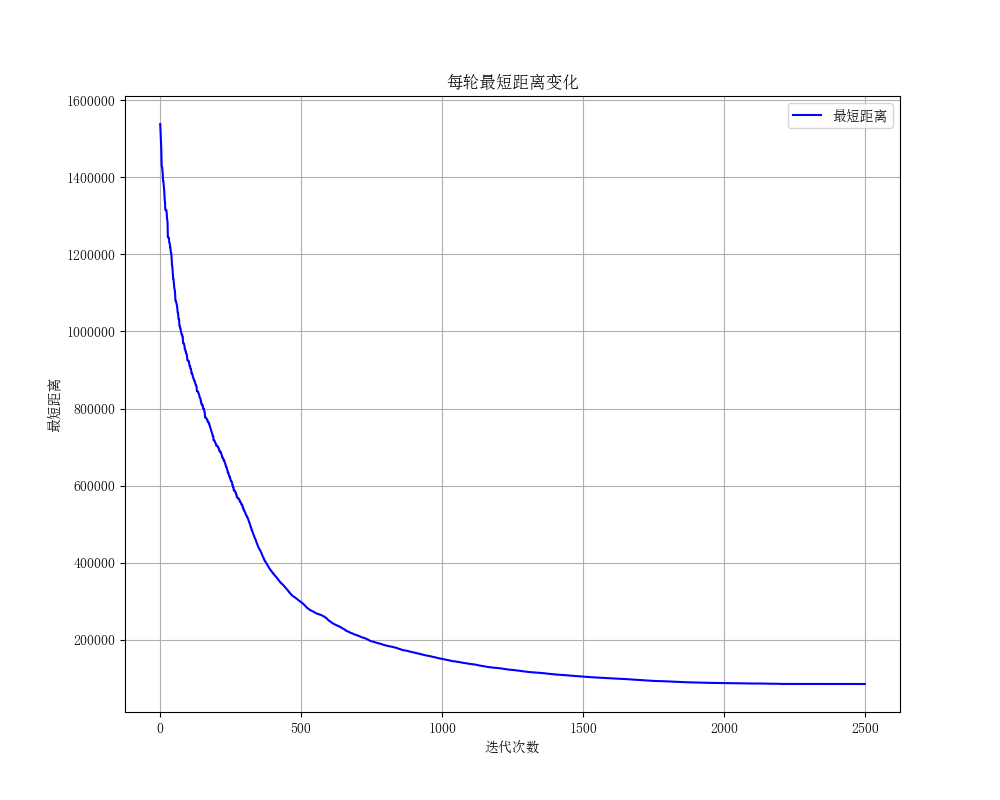
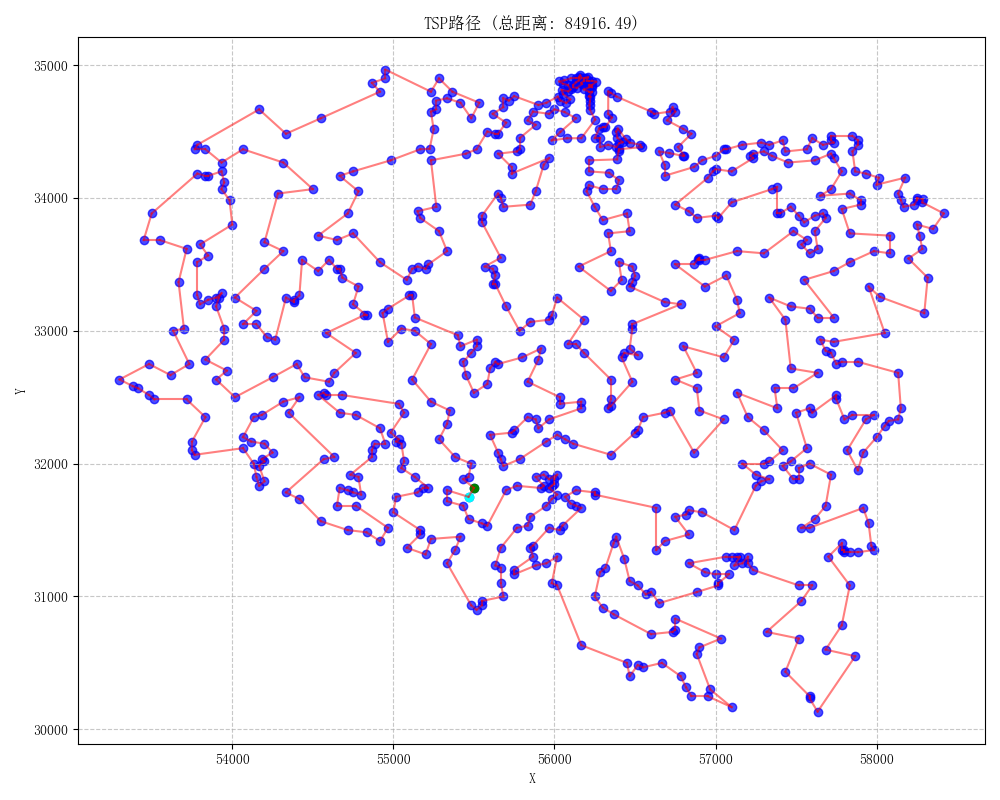

# 人工智能实验报告 实验三 搜索算法
## 一、实验内容
### 2. 启发式搜索
#### i) 算法原理
启发式搜索又叫有信息的搜索，利用问题所拥有的启发信息来引导搜索，达到减少搜索范围，降低问题复杂度的目的。

无信息搜索对所有的可能路径节点一视同仁，而启发式搜索可以指导搜索向最有希望的方向前进。如何评估一个节点的重要性？我们定义启发函数 
$$f(x)=h(x)+g(x)$$
其中 $g(x)$ 是从初始节点到节点 $x$ 付出的实际代价；而 $h(x)$ 是从节点 $x$ 到目标节点的最优路径的估计代价。$h(x)$ 建模了启发式搜索问题中的启发信息，是算法的关键。启发式函数的设计非常重要，合理的定义才能让搜索算法找到一个最优的问题解。

常见的启发式算法有 $\text{A*}$ 算法、迭代加深算法和 $\text{IDA*}$ 算法，其中 $\text{A*}$ 算法的过程为：
- 定义起点 $s$，终点 $t$，从起点（初始状态）开始的距离函数 $g(x)$，到终点（最终状态）的距离函数 $h(x)$，$h^{\ast}(x)$，以及每个点的估价函数 $f(x)=g(x)+h(x)$。
- $\text{A*}$ 算法每次从优先队列中取出一个 $f$ 最小的元素，然后更新相邻的状态。
- 如果 $h\leq h*$，则 $\text{A*}$ 算法能找到最优解。
- 上述条件下，如果 $h$ 满足三角形不等式，则 $\text{A*}$ 算法不会将重复结点加入队列。
- 当 $h=0$ 时，$\text{A*}$ 算法变为 $\text{Dijkstra}$；当 $h=0$ 并且边权为 $1$ 时变为 $\text{BFS}$。

迭代加深搜索的本质还是深度优先搜索，只不过在搜索的同时带上了一个深度 $d$，当 $d$ 达到设定的深度时就返回，一般用于找最优解。如果一次搜索没有找到合法的解，就让设定的深度加一，重新从根开始。

而 $\text{IDA*}$ 实际上就是使用了迭代加深算法的 $\text{A*}$ 算法，其优点有：
1. 不需要判重，不需要排序，利于深度剪枝。
2. 空间需求减少：每个深度下实际上是一个深度优先搜索，不过深度有限制，使用 $\text{DFS}$ 可以减小空间消耗。
#### ii) 实验要求 
尝试使用 $\text{A*}$ 与 $\text{IDA*}$ 算法解决 $\text{15-Puzzle}$ 问题，启发式函数可以自己选取，最好多尝试几种不同的启发式函数。
#### iii) 创新点 & 优化
##### A* 状态的编码与存储
传统的保存棋盘的方法是直接使用二维数组（列表）封装，在 $\text{A*}$ 算法判重时一般需要将整个棋盘存储在哈希表（`std::unordered_set` in C++ or `set` in Python）中。这种实现非低效，原因有两点：
1. 用二维列表存储 16 个数，列表本身的空间占用可能比存储的数据还大
2. 判重的时候需要遍历整个棋盘且极易产生哈希冲突。

考虑优化。我们如果将空格视为 $0$ 并将整个棋盘拍平成一维列表，不难发现此时整个棋盘的状态相当于一个 $0 \sim 15$ 的排列。要表示一个 $0 \sim 15$ 的数只需要 $4$ 个比特位，$16$ 个数仅需要 $4\times 16=64$ 个比特位——恰好可以压进一个`uint64`整数。因此可以直接作为 `std::unordered_set` 或 `Python set` 的哈希值，这样我们就能够将一个排列与一个整数一一对应，使用整数来表示棋盘的状态。查询速度和存储占用都大幅优于传统方案。

为了标准化表示，定义一个映射函数对棋盘进行预处理：
$$y(x):x\mapsto (x-1)\& 16$$
其中 $\&$ 表示按位与。这相当于将原有的 $1\sim15$ 的棋子映射为 $0\sim 14$，而将空格视为 $15$。这样棋盘状态就转为 $0\sim 15$ 的排列，目标状态变成 `0,1,2,...,15`，方便进行判断。
##### 状态的转移
上文的编码优化将二维列表转成一维排列再压缩成单个整数的过程中，会丢失数据原有的二维坐标信息，这会导致状态转移（即将一个拼图移向其相邻的空格）时不好处理。

考虑预处理一个邻接表用来表示一个格子相邻的格子的编号，这样就可以使用类似计算机解决图论问题的实现方式来处理。
##### 多启发函数并行优化
预实验发现算法计算时间随启发函数的变化会有很大的变化，同一个初始状态用不同的启发函数，计算时间可能相差几倍甚至十几倍，且不存在最普遍适用的启发函数。为了尽可能让计算不同问题的时间缩小到可接受的程度，考虑并行执行多个不同启发函数控制下的 $\text{A*}$ 算法，在其一计算出结果后其他进程退出，在特定问题下快速筛选出预定义的多个启发函数最快的那个，再关闭其他进程，仅使用最快的启发函数获得最高性能。
##### IDA* 手写栈优化递归
将 $\text{IDA*}$ 递归调用替换为手动维护的栈结构（保存状态和当前选择的移动方向），避免函数调用开销与系统栈深度限制，经测试性能提升高达数倍。
#### iiii) 关键代码
- 状态编码与存储，将排列（`FlatState`）压缩为整数（`CompressedState`）：
```python
def compress_state(state: FlatState) -> CompressedState:
    return sum([state[i] << (i << 2) for i in range(16)])


def decompress_state(state: CompressedState) -> FlatState:
    return [(state >> (i << 2)) & 0b1111 for i in range(16)]
```
- 状态转移，定义邻接表：
```python
state_adj: list[list[int]] = [
    [1, 4],
    [0, 2, 5],
    [1, 3, 6],
    [2, 7],
    [0, 5, 8],
    [1, 4, 6, 9],
    [2, 5, 7, 10],
    [3, 6, 11],
    [4, 9, 12],
    [5, 8, 10, 13],
    [6, 9, 11, 14],
    [7, 10, 15],
    [8, 13],
    [9, 12, 14],
    [10, 13, 15],
    [11, 14],
]
```
- $\text{A*}$ 算法主过程：
```python
# 输入：一维排列 state
# 输出：操作列表 operation 或报告无解

# 开闭列表
pq: PriorityQueue[StateNode] = PriorityQueue()
pq.put(StateNode(compress_state(state),0,h_func(state),state.index(15)))
dis: dict[int, int] = {compress_state(state): 0}

# 路径追踪
state_from: dict[int, tuple[int, int]] = {}

# 计算目标状态
target_state = compress_state(list(range(16)))

while not pq.empty():
    u_state = pq.get()
    u, g, pos = u_state.wrap()

    u_flat = decompress_state(u)

    if u == target_state:
        return reconstruct_solution(u, state_from)

    if g >= config.a_star_max_steps != 0 and config.a_star_max_steps:
        continue

    for i in adj[pos]:
        u_flat[i], u_flat[pos] = u_flat[pos], u_flat[i]
        v = compress_state(u_flat)
        if g + 1 < dis.get(v, 1000):
            state_from[v] = u, u_flat[pos]
            pq.put(StateNode(v, g + 1, h_func(decompress_state(v)), i))
            dis[v] = g + 1
        u_flat[i], u_flat[pos] = u_flat[pos], u_flat[i]

return None
```
- 启发式函数：
```python
def manhattan(aug: Callable[[int], Union[int, float]]):
    """
    曼哈顿距离
    """

    def h(s: list[int]) -> int:
        return int(aug(sum([abs((s[i] >> 2) - (i >> 2)) + abs((s[i] & 3) - (i & 3)) for i in range(16) if s[i] != 15])))

    return h
```
- $\text{A*}$ 回溯过程并输出路径：
```python
def reconstruct_solution(
    final_state: CompressedState,
    state_from: dict[int, tuple[int, int]],
) -> tuple[list[State], list[int]]:
    state_path = [final_state]
    operation = []
    
    while state_path[-1] in state_from:
        operation.append(state_from[state_path[-1]][1])
        state_path.append(state_from[state_path[-1]][0])
    state_path.reverse()
    operation.reverse()

    sol_state: list[State] = []
    # 将一维排列重建为二维列表
    for state in state_path:
        s = list(map(lambda x: (x + 1) & 0xF, decompress_state(state)))
        matrix = [s[j * 4 : j * 4 + 4] for j in range(4)]
        sol_state.append(matrix)

    return sol_state, operation
```
- $\text{IDA*}$ 算法主过程：
```python
target_state = list(range(16))
if state == target_state:
    return [restore_state(state)], []

max_depth = config.ida_star_max_depth_increment
found = False
while True:
    stack = [(state, 0, state.index(15))]  # (state,last_op,pos)
    adj_idxes = [len(state_adj[state.index(15)]) - 1]
    g = 0
    # 手写栈递归
    while stack:
        u_state, lst_op, pos = stack[-1]
        adj_idx = adj_idxes[-1]
        if adj_idx < 0 or 0 != config.max_solution_length <= g:
            stack.pop()
            adj_idxes.pop()
            g -= 1
            continue
        adj_idxes[-1] -= 1
        v = state_adj[pos][adj_idx]
        if u_state[v] == lst_op:
            continue
        v_state = u_state.copy()
        v_state[pos], v_state[v] = v_state[v], 15
        if g + h_func(v_state) > max_depth:
            continue
        stack.append((v_state, u_state[v], v))
        adj_idxes.append(len(state_adj[v]) - 1)
        g += 1
        if v_state == target_state:
            found = True
            break
    if found:
        sol = [restore_state(i[0]) for i in stack]
        sol_op = [i[1] for i in stack[1:]]
        return sol, sol_op
    max_depth += config.ida_star_max_depth_increment
```
### 4. 遗传算法
#### i) 实验原理
遗传算法是一种模拟自然界生物进化过程的优化算法，其基本原理基于达尔文的进化论。算法通过模拟自然选择、遗传变异等机制，在解空间中搜索最优解。

遗传算法的过程可大致总结为以下几点：
1. 初始化种群：随机生成一组初始解（个体）构成种群
2. 适应度评估：计算每个个体对环境的适应程度
3. 交叉操作：根据适应度，随机从上一代个体选择两个基因，通过个体间的基因交换产生新个体
4. 变异操作：以较小概率改变个体基因
5. 选择操作：根据适应度选取优秀基因进入下一代
#### ii) 实验要求
使用遗传算法解决旅行商人（$\text{TSP}$）问题。
#### iii) 创新点 & 优化
##### 交叉操作的并行优化
遗传算法的每个 $\text{epoch}$ 需要从上一代基因中根据适应度进行一定次的交叉操作，每次交叉操作是独立的，因此这部分可以并行化以提高性能。
##### 算法理论的人类智慧
为了在有限的时空条件下尽可能保证快速收敛且不陷入局部最优，采取了包括但不限于以下几种在实践上可行但正确性不会证的方法：
1. 纯合子致死策略：当双亲基因相同时，设定概率直接使后代死亡，以提高种群基因多样性
2. 变异概率惩罚：上一代没有产出更优的结果时，增大下一代交叉前双亲变异的概率。~~可以认为是点火算法~~
##### 基于语言特性和任务需求的实现针对性优化
Python 在语言效率上主要存在 CPU 使用率低、内存读写延迟大等方面的问题，为提升性能，使用了包括但不限于以下的优化：
1. numpy 优化数组：将大量数组操作改为 numpy 实现，基于 C++ 的 numpy 能尽可能发挥 CPU 性能，并且在能够并行化处理的场景还可以触发 SIMD。
2. 交叉缓冲区预分配与复用：使用预分配的数组而非动态增长的数组来保存交叉结果，防止大量 GC 带来的性能损失。
#### iiii) 关键代码
实验报告编写过程中代码仍然在不断修改（跑的太慢了只能边跑边修），所以实验报告中可能存在与最终代码不匹配的部分，以代码为准。

交叉操作实现了三种交叉算子，分别为
```python
def partial_mapping_crossover(a: NDArray, b: NDArray) -> tuple[NDArray, NDArray]:
    size = len(a)
    cxpoint1, cxpoint2 = sorted(np.random.choice(size, 2, replace=False))

    child1, child2 = np.zeros(size, dtype=int), np.zeros(size, dtype=int)
    child1[cxpoint1:cxpoint2] = b[cxpoint1:cxpoint2]
    child2[cxpoint1:cxpoint2] = a[cxpoint1:cxpoint2]

    mapping1 = {j: i for i, j in zip(a[cxpoint1:cxpoint2], b[cxpoint1:cxpoint2])}
    mapping2 = {i: j for i, j in zip(a[cxpoint1:cxpoint2], b[cxpoint1:cxpoint2])}

    s1 = set(child1[cxpoint1:cxpoint2])
    s2 = set(child2[cxpoint1:cxpoint2])

    for i in range(cxpoint1):
        j = a[i]
        while j in s1:
            j = mapping1[j]
        child1[i] = j

    for i in range(cxpoint2, size):
        j = a[i]
        while j in s1:
            j = mapping1[j]
        child1[i] = j

    for i in range(cxpoint1):
        j = b[i]
        while j in s2:
            j = mapping2[j]
        child2[i] = j

    for i in range(cxpoint2, size):
        j = b[i]
        while j in s2:
            j = mapping2[j]
        child2[i] = j

    return child1, child2


def order_crossover(a: NDArray, b: NDArray) -> tuple[NDArray, NDArray]:
    size = len(a)
    cxpoint1, cxpoint2 = sorted(np.random.choice(size + 1, 2, replace=False))
    mask1, mask2 = np.ones(size, dtype=bool), np.ones(size, dtype=bool)

    mask1[b[cxpoint1:cxpoint2]] = False
    mask2[a[cxpoint1:cxpoint2]] = False

    remaining1 = a[np.where(mask1[a])[0]]
    remaining2 = b[np.where(mask2[b])[0]]

    return (
        np.concatenate((remaining1[:cxpoint1], b[cxpoint1:cxpoint2], remaining1[cxpoint1:])),
        np.concatenate((remaining2[:cxpoint1], a[cxpoint1:cxpoint2], remaining2[cxpoint1:])),
    )


def position_based_crossover(a: NDArray, b: NDArray) -> tuple[NDArray, NDArray]:
    size = len(a)
    sample = np.random.choice(range(size), np.random.randint(1, size), replace=False)
    child1, child2, rs = np.zeros(size, dtype=int), np.zeros(size, dtype=int), np.full(size, 1)
    child1[sample] = a[sample]
    child2[sample] = b[sample]
    rs[sample] = 0
    rs = np.where(rs == 1)[0]
    
    s1 = set(a[i] for i in sample)
    s2 = set(b[i] for i in sample)

    ra = np.array([i for i in b if i not in s1])
    rb = np.array([i for i in a if i not in s2])

    for i, j, k in zip(rs, ra, rb):
        child1[i] = j
        child2[i] = k

    return child1, child2
```
其中`order_crossover`在测试中表现最好，因此经过了针对性实现优化。
也实现了多种的变异算法：
```python
def swap_mutation(gene: NDArray) -> None:
    size = len(gene)
    p1, p2 = np.random.choice(size, size=2, replace=False)
    gene[p1], gene[p2] = gene[p2], gene[p1]


def adjacent_swap_mutation(gene: NDArray) -> None:
    size = len(gene)
    p = np.random.randint(0, size - 1)
    gene[p], gene[p + 1] = gene[p + 1], gene[p]


def range_swap_mutation(gene: NDArray) -> None:
    size = len(gene)
    p1, p2, p3, p4 = sorted(np.random.choice(size, size=4, replace=False))
    rg = min(p2 - p1, p4 - p3)
    p2, p4 = p1 + rg, p3 + rg
    gene[p1:p2], gene[p3:p4] = gene[p3:p4].copy(), gene[p1:p2].copy()


def reverse_mutation(gene: NDArray) -> None:
    size = len(gene)
    p1, p2 = np.random.choice(size, size=2, replace=False)
    gene[p1:p2] = gene[p1:p2][::-1]


def rorate_mutation(gene: NDArray) -> None:
    p1, p2 = sorted(np.random.choice(len(gene), size=2, replace=False))
    gene[p1:p2] = np.roll(gene[p1:p2], shift=1)


def shuffle_mutation(gene: NDArray) -> None:
    size = len(gene)
    p1, p2 = sorted(np.random.choice(size, size=2, replace=False))
    gene[p1:p2] = np.random.permutation(gene[p1:p2])
```
## 二、实验结果及分析
### 2. 启发式搜索
计算时间时使用单进程，取所有预设启发式函数中最快的那一次作为结果。
#### 性能比较（限制最大答案步数为 80）

|                                  初始状态                                  |   $\text{A*}$ 计算时间    | $\text{A*}$ 解的步数 | $\text{IDA*}$ 计算时间    | $\text{IDA*}$ 解的步数 |
| :--------------------------------------------------------------------: | :-------------------: | :--------------: | --------------------- | ------------------ |
| $\begin{bmatrix}1&2&4&8\\5&7&11&10\\13&15&0&3\\14&6&9&12\end{bmatrix}$ | $0.0039 \,\mathrm{s}$ |       $22$       | $0.0010 \,\mathrm{s}$ | $40$               |
| $\begin{bmatrix}14&10&6&0\\4&9&1&8\\2&3&5&11\\12&13&7&15\end{bmatrix}$ | $0.1226 \,\mathrm{s}$ |       $61$       | $0.1000 \,\mathrm{s}$ | $75$               |
| $\begin{bmatrix}5&1&3&4\\2&7&8&12\\9&6&11&15\\0&13&10&14\end{bmatrix}$ | $0.0010 \,\mathrm{s}$ |       $15$       | $0.0010 \,\mathrm{s}$ | $39$               |
| $\begin{bmatrix}6&10&3&15\\14&8&7&11\\5&1&0&2\\13&12&9&4\end{bmatrix}$ | $0.1446 \,\mathrm{s}$ |       $68$       | $0.0135 \,\mathrm{s}$ | $70$               |
| $\begin{bmatrix}11&3&1&7\\4&6&8&2\\15&9&10&13\\14&12&5&0\end{bmatrix}$ | $0.4493 \,\mathrm{s}$ |       $68$       | $0.3258 \,\mathrm{s}$ | $74$               |
| $\begin{bmatrix}0&5&15&14\\7&9&6&13\\1&2&12&10\\8&11&4&3\end{bmatrix}$ | $0.0770 \,\mathrm{s}$ |       $80$       | $0.4097 \,\mathrm{s}$ | $76$               |
解：
```python
# Task 1 A*
[15, 6, 9, 15, 11, 10, 3, 11, 10, 3, 8, 4, 3, 7, 6, 9, 14, 13, 9, 10, 11, 12]
# Task 2 A*
[6, 1, 5, 3, 9, 10, 14, 4, 2, 9, 10, 14, 4, 2, 9, 12, 13, 10, 14, 5, 1, 4, 5, 1, 3, 11, 8, 6, 4, 3, 6, 8, 11, 7, 10, 14, 12, 9, 1, 5, 2, 1, 5, 6, 7, 12, 6, 7, 8, 11, 12, 10, 15, 12, 11, 8, 7, 6, 10, 11, 12]
# Task 3 A*
[13, 10, 14, 15, 12, 8, 7, 2, 5, 1, 2, 6, 10, 14, 15]
# Task 4 A*
[2, 11, 7, 8, 14, 5, 1, 2, 9, 12, 2, 9, 11, 4, 12, 11, 8, 7, 4, 8, 11, 2, 9, 14, 10, 3, 15, 4, 8, 11, 2, 9, 14, 10, 7, 15, 3, 6, 5, 1, 10, 2, 15, 7, 1, 5, 6, 1, 2, 10, 5, 6, 1, 2, 6, 5, 13, 14, 9, 15, 10, 9, 14, 13, 9, 10, 11, 12]
# Task 5 A*
[13, 10, 5, 12, 14, 15, 9, 6, 4, 11, 3, 1, 7, 2, 8, 4, 6, 5, 10, 13, 12, 14, 15, 9, 5, 10, 13, 8, 4, 7, 2, 4, 7, 6, 11, 5, 10, 13, 14, 15, 13, 11, 6, 7, 8, 12, 15, 14, 11, 10, 5, 3, 1, 6, 3, 5, 9, 13, 14, 11, 7, 3, 6, 2, 3, 7, 11, 15]
# Task 6 A*
[5, 9, 7, 5, 9, 7, 6, 13, 10, 12, 13, 15, 7, 6, 2, 13, 15, 10, 12, 3, 4, 15, 10, 12, 3, 4, 15, 11, 13, 10, 12, 7, 14, 3, 4, 12, 7, 14, 6, 2, 14, 7, 10, 14, 5, 1, 8, 13, 14, 8, 1, 5, 8, 10, 7, 8, 5, 9, 2, 6, 3, 4, 8, 7, 10, 1, 9, 5, 1, 9, 5, 1, 6, 2, 1, 5, 9, 10, 11, 15]
# ------------------------------
# Task 1 IDA*
[9, 12, 3, 9, 12, 3, 9, 12, 3, 9, 12, 3, 9, 6, 15, 9, 6, 15, 14, 13, 9, 6, 3, 10, 11, 3, 10, 11, 3, 7, 6, 10, 7, 3, 8, 4, 3, 7, 11, 12]
# Task 2 IDA*
[8, 11, 15, 7, 13, 12, 2, 3, 12, 13, 7, 15, 5, 12, 3, 2, 13, 7, 15, 5, 12, 3, 9, 1, 6, 10, 1, 4, 14, 1, 4, 6, 10, 4, 6, 10, 3, 15, 5, 12, 11, 8, 4, 3, 10, 14, 2, 9, 15, 5, 7, 15, 14, 10, 5, 7, 15, 14, 10, 2, 1, 6, 2, 5, 3, 2, 6, 1, 5, 6, 2, 3, 7, 11, 12]
# Task 3 IDA*
[13, 10, 14, 15, 11, 14, 15, 11, 14, 15, 11, 14, 15, 11, 14, 15, 11, 14, 15, 11, 14, 15, 11, 14, 15, 11, 14, 15, 12, 8, 7, 2, 5, 1, 2, 6, 10, 14, 15]
# Task 4 IDA*
[9, 12, 13, 5, 1, 9, 2, 4, 12, 2, 7, 11, 4, 7, 11, 8, 14, 1, 5, 13, 2, 11, 7, 4, 8, 14, 10, 6, 1, 5, 9, 7, 14, 8, 4, 12, 11, 14, 7, 2, 14, 7, 2, 10, 6, 3, 15, 4, 8, 2, 10, 6, 2, 15, 3, 2, 6, 10, 15, 8, 12, 15, 7, 11, 15, 12, 8, 7, 11, 15]
# Task 5 IDA*
[5, 12, 14, 15, 9, 10, 12, 5, 13, 12, 5, 13, 12, 5, 8, 2, 5, 8, 10, 6, 2, 1, 3, 2, 4, 11, 2, 4, 1, 5, 8, 12, 13, 14, 15, 9, 11, 1, 5, 3, 4, 2, 1, 5, 6, 15, 14, 13, 12, 8, 7, 4, 3, 7, 8, 10, 15, 14, 13, 15, 14, 11, 9, 13, 11, 14, 10, 12, 15, 11, 14, 10, 11, 15]
# Task 6 IDA*
[7, 1, 8, 11, 2, 9, 5, 7, 1, 8, 9, 2, 11, 9, 8, 5, 6, 12, 10, 3, 4, 10, 12, 13, 3, 12, 13, 15, 14, 3, 12, 4, 10, 13, 15, 6, 2, 11, 13, 15, 6, 14, 7, 2, 14, 6, 11, 8, 9, 13, 15, 11, 8, 14, 6, 8, 4, 12, 8, 4, 11, 10, 12, 11, 10, 15, 14, 10, 11, 8, 4, 7, 3, 4, 8, 12]
```
#### 性能比较（不限制最大答案步数）
|                                  初始状态                                  |   $\text{A*}$ 计算时间    | $\text{A*}$ 解的步数 | $\text{IDA*}$ 计算时间    | $\text{IDA*}$ 解的步数 |
| :--------------------------------------------------------------------: | :-------------------: | :--------------: | --------------------- | ------------------ |
| $\begin{bmatrix}1&2&4&8\\5&7&11&10\\13&15&0&3\\14&6&9&12\end{bmatrix}$ | $0.0040 \,\mathrm{s}$ |       $24$       | $0.0001 \,\mathrm{s}$ | $40$               |
| $\begin{bmatrix}14&10&6&0\\4&9&1&8\\2&3&5&11\\12&13&7&15\end{bmatrix}$ | $0.1226 \,\mathrm{s}$ |       $61$       | $0.0075 \,\mathrm{s}$ | $141$              |
| $\begin{bmatrix}5&1&3&4\\2&7&8&12\\9&6&11&15\\0&13&10&14\end{bmatrix}$ | $0.0010 \,\mathrm{s}$ |       $15$       | $0.0001 \,\mathrm{s}$ | $39$               |
| $\begin{bmatrix}6&10&3&15\\14&8&7&11\\5&1&0&2\\13&12&9&4\end{bmatrix}$ | $0.1441 \,\mathrm{s}$ |       $68$       | $0.0040 \,\mathrm{s}$ | $134$              |
| $\begin{bmatrix}11&3&1&7\\4&6&8&2\\15&9&10&13\\14&12&5&0\end{bmatrix}$ | $0.4505 \,\mathrm{s}$ |       $68$       | $0.0120 \,\mathrm{s}$ | $102$              |
| $\begin{bmatrix}0&5&15&14\\7&9&6&13\\1&2&12&10\\8&11&4&3\end{bmatrix}$ | $0.0765 \,\mathrm{s}$ |       $80$       | $0.0089 \,\mathrm{s}$ | $112$              |
这部分的解省略。
可见 $\text{A*}$ 算法对步数上界的要求较为宽松，而增大步数限制对 $\text{IDA*}$ 的提升显著，这主要是由搜索策略引起的。

### 4. 遗传算法
不同实现的遗传算法较难直接比较，仅给出测试过的所有样例中，能够收敛到（或在有限时间能收敛到）的大致最短路径长度（定数或约数）：

| 测例     | 最短路长度    |
| ------ | -------- |
| wi29   | 27601.17 |
| dj38   | 6659.43  |
| qa194  | ~9800    |
| uy734  | ~85000   |
| ja9847 | ~3000000 |
给出`uy734`运行 2000 轮，每轮的最优解作为实例：

最终结果：

具体运行日志（种群数量、每轮交叉数量、运行轮次、运行时间等）随报告附送，参见`runs.zip`。
## 三、参考资料
- $\text{15-puzzle}$ 可解性判断： https://oi-wiki.org/misc/15-puzzle/
- 另一个 $\text{15-puzzle}$ 可解性判断： https://blog.csdn.net/qq_30142297/article/details/124060147
- $\text{A*}$ 实现参考： https://oi-wiki.org/search/astar/
- 迭代加深搜索： https://oi-wiki.org/search/iterative/
- $\text{IDA*}$ 实现参考： https://oi-wiki.org/search/idastar/
- 遗传算法中几种交叉算子小结： https://blog.csdn.net/u012750702/article/details/54563515