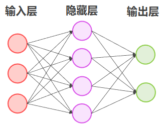
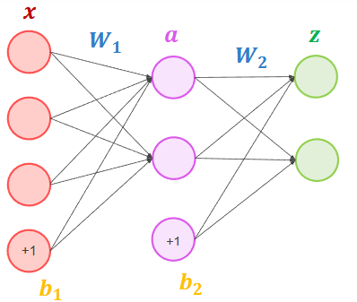
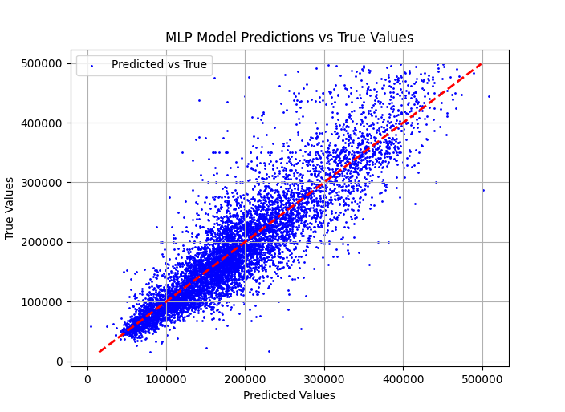
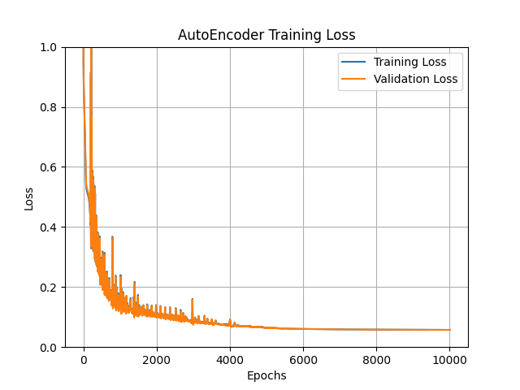
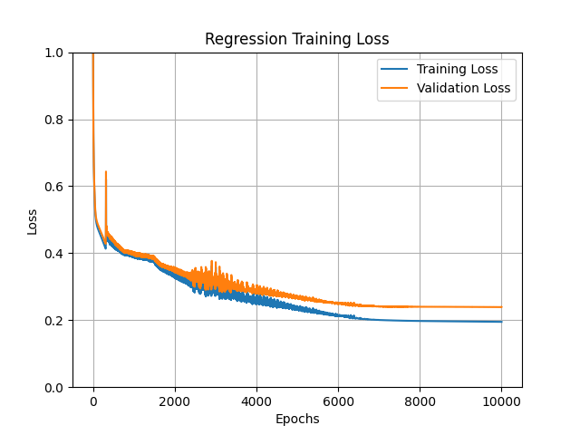
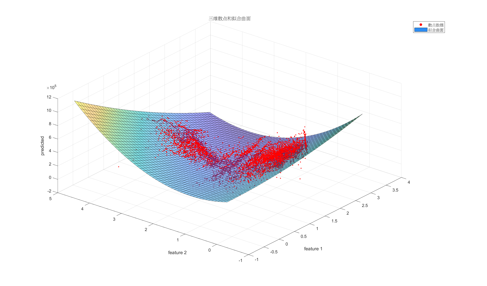

# 人工智能实验报告 实验四 机器学习基础
## 一、实验原理
多层神经网络：即多层感知机（Multi-Layer Perceptron，简称MLP）包含三个层次：一个输入层，一个或多个中间层 (也叫隐藏层，hidden layer) 和一个输出层。输入层与输出层的节点数是固定的，中间层则可以自由指定。

使用向量和矩阵来表示神经网络中的变量。$x,a,z$ 是网络中传输的向量数据。 $W_1,W_2$ 是网络的矩阵参数。MLP 通常还会引入偏置单元，记为 $b$。

MLP 前向传播的矩阵运算公式为（以一层隐藏层为例）： $$\begin{align}
a&=g(W_1\times x+b_1) \\[4pt]
z&=W_2 \times a+b_2 \\[4pt]
\end{align}$$
其中 $g$ 是非线性激活函数，一般选取 sigmoid，ReLU，tanh 的一种。

定义损失函数 $\displaystyle L=(z-Y)^2$，可得反向传播的公式为：$$\begin{align}
\,\mathrm{d}W_2&=\frac{\partial L}{\partial W_2}=\frac{\partial L}{\partial z}\cdot \frac{\partial z}{\partial W_2}=2(z-y_\text{true})a^T \\[4pt]
\,\mathrm{d}b_2&=\frac{\partial L}{\partial b_2}=\frac{\partial L}{\partial z}\cdot \frac{\partial z}{\partial b_2}=2(z-y_\text{true}) \\[4pt]
\,\mathrm{d}W_1&=\frac{\partial L}{\partial W_1}=\frac{\partial L}{\partial z}\cdot \frac{\partial z}{\partial a}\cdot \frac{\partial a}{\partial W_1}=2(z-y_\text{true})W_2^T g^{-1}(W_1 \times x+b_1)x^T \\[4pt]
\,\mathrm{d}b_1&=\frac{\partial L}{\partial b_1}=\frac{\partial L}{\partial z}\cdot \frac{\partial z}{\partial a}\cdot \frac{\partial a}{\partial b_1}=2(z-y_\text{true})W_2^Tg^{-1}(W_1 \times x+b_1)
\end{align}$$
可以省略梯度前面的常数 $2$；

多组（设组数为 $m$）训练时不需要对每一组单独进行一次前向传播和反向传播，考虑将 $x$ 向量合并为矩阵传入，此时输出 $a,z$ 变为矩阵，偏置单元需要拓展为向量进行运算，有 

$$
\begin{align}
A&=g(W_1 \times X+B_1) \\[4pt]
Z&=W_2 \times A+B_2 \\[4pt]
L&=\frac{1}{m}(Z-Y)^2 \\[4pt]
\,\mathrm{d}W_2&=\frac{2}{m}(Z-Y) A^T \\[4pt]
\,\mathrm{d}b_2&=\frac{2}{m}(Z-Y) \\[4pt]
\,\mathrm{d}W_1&=\frac{2}{m}(Z-Y)W_2^Tg^{-1}(W_1 \times X+B_1)X^T \\[4pt]
\,\mathrm{d}b_1&=\frac{2}{m}(Z-Y)W_2^Tg^{-1}(W_1 \times X+B_1)
\end{align}
$$

对更多层的 MLP 可用链式法则求导，可导出类似的结论。

## 二、实验内容
房价预测任务：`data.csv`数据集包含五个属性，共 10000 条数据，其中`longitude`和`latitude`表示房子经纬度，`housing_age`表示房子年龄，`homeowner_income`表示房主的收入（单位：十万元）， `house_price`表示房子的价格。请根据数据集`data.csv`中四个属性`longitude`、`latitude`、`housing_age`、`homeowner_income`，利用**感知机算法**预测房价`house_price`，并画出数据可视化图、loss 曲线图。
## 三、创新优化
- 噪声去除：观察到数据中存在一部分房价均为 500001，猜测数据源将房价大于 500000 的值均隐藏。因为这类数据不多且没有明显输入特征，因此将他们当作噪声提前删除。
- 数据划分：将数据划分为训练集和测试集，从而更好评估模型的泛化能力。
- MLP 降维：原数据的四维输入无法直接用于可视化，因此考虑使用 MLP 搭建一个自编码器，先将四维输入编码为二维，再使用解码器还原回四维，从而能够在训练过程中引导 MLP 提取四维数据的特征并学习到有效的二维特征表示。因为原数据的四维输入并不算多，因此没必要将编码器输出接入回归器，两个模型可以独立训练。
## 四、关键代码
MLP 类：
```python
class MLP:
  weights: list[NDArray[np.float64]]  # 权重
  biases: list[NDArray[np.float64]]  # 偏置
  z: list[NDArray[np.float64]]
  a: list[NDArray[np.float64]]

  def __init__(self, input_size: int, hidden_sizes: list[int], output_size: int):
    self.layers_dim = [input_size] + hidden_sizes + [output_size]
    self.num_layers = len(self.layers_dim) - 1

    self.weights = []
    self.biases = []

    for i in range(self.num_layers):
      self.weights.append(np.random.randn(self.layers_dim[i], self.layers_dim[i + 1]) * np.sqrt(2.0 / self.layers_dim[i]))
      self.biases.append(np.zeros((1, self.layers_dim[i + 1])))

    self.z = [np.zeros(1)] * self.num_layers
    self.a = [np.zeros(1)] * (self.num_layers + 1)

  def relu(self, x: NDArray[np.float64]):
    return np.maximum(0, x)

  def relu_derivative(self, x: NDArray[np.float64]):
    return np.where(x > 0, 1, 0)

  def forward(self, x: NDArray[np.float64]):
    self.a[0] = x

    for i in range(self.num_layers - 1):
      self.z[i] = np.dot(self.a[i], self.weights[i]) + self.biases[i]
      self.a[i + 1] = self.relu(self.z[i])

    self.z[-1] = np.dot(self.a[-2], self.weights[-1]) + self.biases[-1]
    self.a[-1] = self.z[-1]

    return self.a[-1]

  def backward(self, x: NDArray[np.float64], y: NDArray[np.float64], lr: float):
    m = x.shape[0]  # 样本数量

    # 输出层的梯度
    dz = self.a[-1] - y

    dW: list = [None] * self.num_layers
    db: list = [None] * self.num_layers

    for i in range(self.num_layers - 1, -1, -1):
      if i == self.num_layers - 1:
        dW[i] = (1 / m) * np.dot(self.a[i].T, dz)
        db[i] = (1 / m) * np.sum(dz, axis=0, keepdims=True)
      else:
        dz = np.dot(dz, self.weights[i + 1].T) * self.relu_derivative(self.z[i])
        dW[i] = (1 / m) * np.dot(self.a[i].T, dz)
        db[i] = (1 / m) * np.sum(dz, axis=0, keepdims=True)

    for i in range(self.num_layers):
      # 更新权重和偏置
      self.weights[i] -= lr * dW[i]
      self.biases[i] -= lr * db[i]

  def cosine_annealing(self, epoch: int, warmup_epochs: int, min_lr: float, base_lr: float) -> float:
    # 余弦退火
    if epoch < warmup_epochs:
      return max(min_lr, base_lr * (epoch / warmup_epochs))
    else:
      return max(
        min_lr,
        base_lr * (1 + np.cos((epoch - warmup_epochs) / (num_epochs - warmup_epochs) * np.pi)) / 2,
      )

  def train(
    self,
    x_train: NDArray[np.float64],
    y_train: NDArray[np.float64],
    x_val: NDArray[np.float64],
    y_val: NDArray[np.float64],
    base_lr: float,
    min_lr: float,
    num_epochs: int,
    warmup_epochs: int = 0,
  ) -> tuple[list[float], list[float]]:
    losses = []
    val_losses = []

    for epoch in range(num_epochs):
      # 前向传播
      y_pred = self.forward(x_train)
      # 计算 L_{MSE}
      loss = np.mean(np.square(y_pred - y_train))
      losses.append(loss)

      # 反向传播
      self.backward(x_train, y_train, self.cosine_annealing(epoch, warmup_epochs, min_lr, base_lr))

      y_pred_val = self.forward(x_val)
      val_loss = np.mean(np.square(y_pred_val - y_val))
      val_losses.append(val_loss)
      # val_loss = 0
      if (epoch + 1) % 10 == 0:
        print(
          f'Epoch [{epoch+1}/{num_epochs}], Training Loss: {loss:.4f}, Validation Loss: {val_loss:.4f}, lr: {self.cosine_annealing(epoch, warmup_epochs, min_lr, base_lr):.4f}'
        )

    return losses, val_losses
```
基于 MLP 构造 Auto Encoder：
```python
class AutoEncoder(MLP):
  encode_output_layer: int

  def __init__(
    self,
    input_size: int,
    encoder_hidden_sizes: list[int],
    decoder_hidden_sizes: list[int],
    output_size: int,
  ):
    super().__init__(
      input_size,
      encoder_hidden_sizes + [output_size] + decoder_hidden_sizes,
      input_size,
    )

    self.encode_output_layer = len(encoder_hidden_sizes)  # 编码器的输出层索引

  def forward(self, x: NDArray[np.float64]) -> tuple[NDArray[np.float64], NDArray[np.float64]]:
    super().forward(x)

    return self.z[self.encode_output_layer], self.a[-1]  # 返回编码器输出和解码器输出

  def train(  # type:ignore
    self,
    x_train: NDArray[np.float64],
    x_val: NDArray[np.float64],
    base_lr: float,
    min_lr: float,
    num_epochs: int,
    warmup_epochs: int = 0,
  ) -> tuple[list[float], list[float]]:
    losses = []
    val_losses = []

    for epoch in range(num_epochs):
      # 前向传播
      encoded, decoded = self.forward(x_train)
      # 计算 L_{MSE}
      loss = np.mean(np.square(decoded - x_train))
      losses.append(loss)

      # 反向传播
      self.backward(x_train, x_train, self.cosine_annealing(epoch, warmup_epochs, min_lr, base_lr))

      encoded, decoded = self.forward(x_val)
      val_loss = np.mean(np.square(decoded - x_val))
      val_losses.append(val_loss)
      if (epoch + 1) % 10 == 0:
        print(
          f'Epoch [{epoch+1}/{num_epochs}], Training Loss: {loss:.4f}, Validation Loss: {val_loss:.4f}, lr: {self.cosine_annealing(epoch, warmup_epochs, min_lr, base_lr):.4f}'
        )

    return losses, val_losses
```
训练模型：
```python
# 1. 定义模型参数
input_size = 4
autoencoder_encoder_hidden_sizes = [16]
autoencoder_decoder_hidden_sizes = [16]
autoencoder_output_size = 2
hidden_sizes = [16, 64, 16]
output_size = 1
autoencoder_base_learning_rate = 0.1
regression_base_learning_rate = 0.5
autoencoder_warmup_epochs = 300
regression_warmup_epochs = 1500
num_epochs = 10000

# 2. 创建模型
autoencoder = AutoEncoder(
  input_size,
  autoencoder_encoder_hidden_sizes,
  autoencoder_decoder_hidden_sizes,
  autoencoder_output_size,
)
regression = MLP(input_size, hidden_sizes, output_size)

# 3. 读取训练数据
mlp_data = pd.read_csv('MLP_data.csv')
X_train_raw = mlp_data.iloc[:, :-1].values
y_train_raw = cast(NDArray, mlp_data.iloc[:, -1].values).reshape(-1, 1)

# 4. 数据标准化
x_mean, x_std = np.mean(X_train_raw, axis=0), np.std(X_train_raw, axis=0)
x_train = (X_train_raw - x_mean) / x_std
y_mean, y_std = np.mean(y_train_raw), np.std(y_train_raw)
y_train = (y_train_raw - y_mean) / y_std

x_train, x_val, y_train, y_val = train_test_split(x_train, y_train, test_size=0.2, random_state=42)

# 5. 训练模型
losses1 = autoencoder.train(
  x_train,
  x_val,
  autoencoder_base_learning_rate,
  0.01,
  num_epochs,
  autoencoder_warmup_epochs,
)

losses2 = regression.train(
  x_train,
  y_train,
  x_val,
  y_val,
  regression_base_learning_rate,
  0.05,
  num_epochs,
  regression_warmup_epochs,
)

# 6. 画图
plt.autoscale()
outputs = regression.forward(x_train) * y_std + y_mean

# 画一条 y=x 的线
plt.plot(
  [np.min(y_train) * y_std + y_mean, np.max(y_train) * y_std + y_mean],
  [np.min(y_train) * y_std + y_mean, np.max(y_train) * y_std + y_mean],
  'r--',
  lw=2,
)

# 散点图
plt.scatter(outputs, y_train * y_std + y_mean, s=1, color='blue', label='Predicted vs True')

# 标签
plt.xlabel('Predicted Values')
plt.ylabel('True Values')
plt.title('MLP Model Predictions vs True Values')
plt.legend()
plt.grid()
plt.show()

# 输出降维和预测结果到 csv，用于 matlab 可视化
# pyplot 画 3d 图会卡死，费解
encoded = autoencoder.forward(x_train)[0]
df = pd.DataFrame(np.hstack((encoded, outputs)), columns=['feature1', 'feature2', 'predicted'])
df.to_csv('MLP_output.csv', index=False)

# 降维器损失曲线
plt.figure()
plt.plot(losses1[0], label='Training Loss')
plt.plot(losses1[1], label='Validation Loss')
plt.title('AutoEncoder Training Loss')
plt.ylim(0,1)
plt.xlabel('Epochs')
plt.ylabel('Loss')
plt.legend()
plt.grid()
plt.show()

# 回归器损失曲线
plt.figure()
plt.plot(losses2[0], label='Training Loss')
plt.plot(losses2[1], label='Validation Loss')
plt.title('Regression Training Loss')
plt.ylim(0,1)
plt.xlabel('Epochs')
plt.ylabel('Loss')
plt.legend()
plt.grid()
plt.show()
```
使用 matlab 对预测散点图进行可视化并拟合：
```matlab
clear;
clc;

data = readmatrix('MLP_output.csv');

x = data(:, 1);
y = data(:, 2);
z = data(:, 3);

sf = fit([x, y], z, 'poly22');

[X, Y] = meshgrid(linspace(min(x), max(x), 50), linspace(min(y), max(y), 50));
Z = sf(X, Y);

figure;
scatter3(x, y, z, 5, 'red', 'filled');
hold on;
surf(X, Y, Z, 'FaceAlpha', 0.5);
hold off;

title('三维散点和拟合曲面');
xlabel('feature 1');
ylabel('feature 2');
zlabel('predicted');
legend('散点数据', '拟合曲面');
grid on;
view(3);
```
## 五、实验结果
预测值与真实值比较：


自编码器训练 Loss：

回归器训练 Loss：

可视化结果：

最终的 Loss 指标：
```
AutoEncoder: Epoch [10000/10000], Training Loss: 0.0572, Validation Loss: 0.0574
Regression: Epoch [10000/10000], Training Loss: 0.1949, Validation Loss: 0.2391
```
从 Loss 曲线可知训练集和验证集效果差异不大，因此可推断模型具有较好的泛化性能。

Loss 曲线前中期震荡较大，主要是初始学习率较大导致，后期使用余弦退火控制学习率能正常收敛。