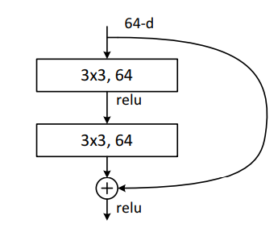
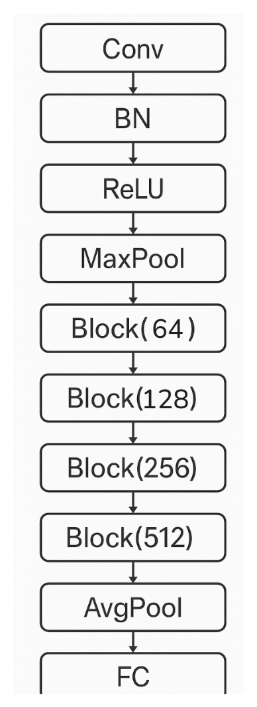
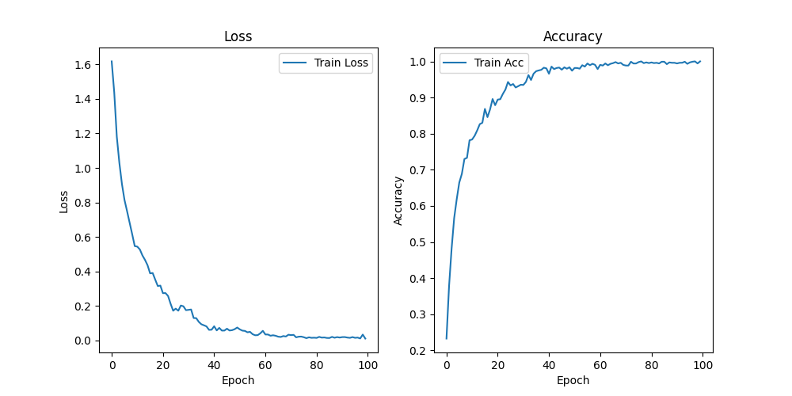

# 人工智能实验报告 实验五 深度学习
## 一、实验题目
利用pytorch框架搭建神经网络实现中药图片分类，其中中药图片数据分为训练集`train`和测试集`test`，训练集仅用于网络训练阶段，测试集仅用于模型的性能测试阶段。训练集和测试集均包含五种不同类型的中药图片：`baihe`、`dangshen`、`gouqi`、`huaihua`、`jinyinhua`。请合理设计神经网络架构，利用训练集完成网络训练，统计网络模型的训练准确率和测试准确率，画出模型的训练过程的loss曲线、准确率曲线。
## 二、实验内容
### 1. 算法原理
卷积神经网络，即 CNN，是一种专门用于处理具有类似网格结构的数据的深度学习模型，尤其在图像处理领域表现出色。

CNN 通过卷积操作自动学习图像中的空间层次特征，从而能够有效地进行图像分类任务。与传统的 MLP 相比，CNN 利用卷积和池化等操作，显著减少了模型参数量，降低了计算复杂度，并具有良好的平移不变性。

CNN 的核心操作有卷积和池化，前者使用一个小的可学习的滤波器（称作卷积核）在输入图像上滑动，并对每个位置执行点积运算，模拟人眼进行局部特征的提取；后者可以降低特征图的维度，从而降低计算量。通过反复进行卷积和池化的循环，可以搭建较为深层的神经网络，学习更多图形的特征。
### 2. 模型结构
我设计的模型结构是简化版的残差神经网络（ResNet），其核心是称为残差块的卷积层：

输入的数据会经过两条通路，第一条是正常的两次卷积池化，第二条则是直接跳过卷积层（可能需要下采样）与第一条通路的结果相加。这样做的优势在于，即使两层卷积没有提取出有效信息（比如深层网络），也可以直接将上个残差块的结果直接传到下一层，从而避免梯度消失的情况。

将四组指定维度的残差块堆叠作为模型 backbone，添加头尾构成完整模型：

其中前四层作为网络前端，作用是从图片中提取初始特征，可以减少后续残差块的计算量；最后的两层首先通过平均池化将 512 张 $7 \times 7$ 的特征图变为 512 维特征向量，再传入全连接层进行分类。
### 3. 实验方法
实验流程如下：
1. 从文件夹中分别读取训练集和测试集的图片
2. 初始化数据增强
3. 构建训练集和加载器 DataLoader
4. 每个 epoch 从 DataLoader 取以 batch 为单位的数据，传入 model 得到输出 output
5. 用交叉熵损失 CrossEntropyLoss 从 output 和 label 获得 loss
6. 用 argmax 从 output 获得预测类别 label，与 label 比较获得准确率 accuracy
7. 对 loss 和 acc 取均值并记录
8. 利用梯度下降进行反向传播，更新模型参数
9. 用 AdamW 优化器对模型参数进行优化
10. 用 lr_scheduler 对学习率进行细调
11. 模型切换到 eval 模式，禁用梯度并进行测试
12. 画出训练的 Loss 及 Acc 曲线图

### 4. 实验优化
#### 数据增强
在比较小的训练集上进行训练容易造成过拟合。考虑进行高强度数据增强防止此种现象发生，同时提高模型的泛化性，使其在测试集上的表现更佳。

考虑引入`ColorJitter`和`RandomResizedCrop`，前者通过调整图片色调等参数，迫使模型不只依靠颜色而同时学习中药的形状来辨别，这在`dangshen`、`baihe`和`jinyinhua`三类的识别率上有明显的优化效果，后者则对图片局部进行随机裁剪和缩放，进一步提升数据的多样性。
#### 混合精度训练
使用`torch.autocast('cuda')`在前向传播中自动将部分操作降低为精度更低的数据类型（通常是`FP16`或`BF16`）进行运算，从而在保证准确率基本不变的情况的同时降低资源并加速计算。
### 优化器和学习率调度器
使用 AdamW 对模型参数进行优化；调度器使用自定义调度函数，采用线性预热+余弦退火的结合，保证了在更快收敛到良好的起点的同时，还能在训练的后半段平滑学习率以保证模型能顺利收敛。
## 三、关键代码：
### 模型结构
```python
class Block(nn.Module): # 残差块
  def __init__(
    self,
    in_planes: int,
    out_planes: int,
    stride: int = 1,
    need_downsample: bool = False,
  ) -> None:
    super().__init__()
    self.conv1 = nn.Conv2d(
      in_planes,
      out_planes,
      kernel_size=3,
      stride=stride,
      padding=1,
      bias=False,
    )
    self.bn1 = nn.BatchNorm2d(out_planes)
    self.relu = nn.ReLU(inplace=True)
    self.conv2 = nn.Conv2d(
      out_planes,
      out_planes,
      kernel_size=3,
      padding=1,
      bias=False,
    )
    self.bn2 = nn.BatchNorm2d(out_planes)
    
    # 输入和输出维度不同的情况下需要对捷径下取样
    self.downsample = (
      nn.Sequential(
        nn.Conv2d(in_planes, out_planes, kernel_size=1, stride=stride, bias=False),
        nn.BatchNorm2d(out_planes),
      )
      if need_downsample
      else None
    )

  def forward(self, x: Tensor) -> Tensor:
    identity = x

    out = self.conv1(x)
    out = self.bn1(out)
    out = self.relu(out)

    out = self.conv2(out)
    out = self.bn2(out)

    if self.downsample is not None:
      identity = self.downsample(x)

    out += identity  # shortcut
    out = self.relu(out)

    return out


class ResNet(nn.Module):
  def __init__(
    self,
    num_classes: int = 1000,
  ) -> None:
    super().__init__()
    self.conv = nn.Conv2d(3, 64, kernel_size=7, stride=2, padding=3, bias=False)  # 64, 112, 112
    self.bn = nn.BatchNorm2d(64)
    self.relu = nn.ReLU(inplace=True)
    self.maxpool = nn.MaxPool2d(kernel_size=3, stride=2, padding=1)
    self.layers = nn.Sequential(
      Block(64, 64),  # 64, 56, 56
      Block(64, 64),
      Block(64, 128, stride=2, need_downsample=True),  # 128, 28, 28
      Block(128, 128),
      Block(128, 256, stride=2, need_downsample=True),  # 256, 14, 14
      Block(256, 256),
      Block(256, 512, stride=2, need_downsample=True),  # 512, 7, 7
      Block(512, 512),
    )
    self.avgpool = nn.AdaptiveAvgPool2d((1, 1)) # 512, 1, 1
    self.fc = nn.Linear(512, num_classes)

  def forward(self, x: Tensor) -> Tensor:
    x = self.conv(x)
    x = self.bn(x)
    x = self.relu(x)
    x = self.maxpool(x)

    x = self.layers(x)

    x = self.avgpool(x)
    x = torch.flatten(x, 1)  # 512,1,1 -> 512
    x = self.fc(x)

    return x
```
### 数据集读取
```python
class CostomDataset(torch.utils.data.Dataset):
  data: list[Tensor]
  labels: list[int]
  transform: transforms.Compose

  def __init__(self, device: torch.device, path: Path, transform: transforms.Compose):
    global class_dict
    class_dict = {}

    self.data = []
    self.labels = []
    for i, folder in enumerate(path.iterdir()):
      class_dict[folder.name] = i
      for file in folder.iterdir():
        # decode_image 读进来就是 Tensor 不需要经历从 PIL 转 Tensor 的过程
        # 空间充足的情况下直接放进显存加速后续读取
        self.data.append(decode_image(str(file), ImageReadMode.RGB).to(device))
        self.labels.append(i)
    self.transform = transform

  def __len__(self):
    return len(self.data)

  def __getitem__(self, idx):
    x = self.data[idx]
    y = self.labels[idx]

    x = self.transform(x)

    return x, y

```
### 数据增强
```python
class ZeroOneNormalize:
  """
  decode_image 默认读取为 uint8 类型，范围为 [0, 255]
  需要手动转到 [0,1] 的范围
  """

  def __call__(self, tensor: torch.Tensor):
    return tensor.float().div(255)

train_transform = transforms.Compose(
  [
    transforms.ColorJitter(brightness=0.5, contrast=0.5, saturation=0.5, hue=0.1),
    transforms.RandomResizedCrop(224, scale=(0.8, 1)),
    ZeroOneNormalize(),
    transforms.Normalize([0.5, 0.5, 0.5], [0.5, 0.5, 0.5]),
  ]
)

test_transform = transforms.Compose(
  [
    transforms.Resize((224, 224)),
    ZeroOneNormalize(),
    transforms.Normalize([0.5, 0.5, 0.5], [0.5, 0.5, 0.5]),
  ]
)
```
### 调度函数
```python
def lr_func(epoch: int):
  return min((epoch + 1) / (warmup_epochs + 1e-8), 0.5 * (math.cos(epoch / epochs * math.pi) + 1))
```
### 训练过程
```python
optimizer = torch.optim.AdamW(model.parameters(), lr=lr, weight_decay=1e-4)

lr_scheduler = torch.optim.lr_scheduler.LambdaLR(optimizer, lr_lambda=lr_func)

scaler = torch.GradScaler()  # 混合精度训练的 loss 缩放器

train_losses = []
train_accs = []

for epoch in range(epochs):
  train_loss = 0.0
  train_acc = 0.0
  model.train()
  for inputs, labels in train_loader:
    labels = labels.to(device)

    optimizer.zero_grad()

    with torch.autocast('cuda'):  # 混合精度训练
      outputs = model(inputs)
      loss = criterion(outputs, labels)
    scaler.scale(loss).backward()  # 反向传播
    scaler.step(optimizer)
    scaler.update()

    pred = outputs.argmax(dim=1)
    correct = (pred == labels).sum().item()
    acc = correct / len(labels)

    train_loss += loss.item()
    train_acc += acc

  lr_scheduler.step()

  print(
    f'Epoch {epoch + 1}/{epochs}'
    f' LR: {optimizer.param_groups[0]["lr"]:.6f}'
    f' Train Loss: {train_loss / len(train_loader):.4f}'
    f' Train Acc: {train_acc / len(train_loader):.4f}'
  )

  train_losses.append(train_loss / len(train_loader))
  train_accs.append(train_acc / len(train_loader))
```
### 测试过程
```python
# 准备测试数据
test_img: list[Tensor] = []

test_label_list: list[int] = []

for img_path in (root / 'test').iterdir():
  test_img.append(test_transform(decode_image(str(img_path), ImageReadMode.RGB)))
  test_label_list.append(class_dict[img_path.name.split('.')[0][:-2]])  # 提取文件名中的中药拼音并转换为索引

test_labels: Tensor = torch.tensor(test_label_list).to(device)

test_inputs = torch.stack(test_img, dim=0).to(device)

# 测试
with torch.no_grad():
  model.eval()
  outputs = model(test_inputs)
  loss = criterion(outputs, test_labels)

  pred = outputs.argmax(dim=1)
  correct = (pred == test_labels).sum().item()
  acc = correct / len(test_inputs)

  print(f'Test Loss: {loss.item():.4f}' f' Test Acc: {acc:.4f}')
```
## 四、实验结果
取 lr=1e-3，batchsize=256，经过 100 个 epoch 的训练，Loss 及 Acc 曲线如下图：

最后 10 个 epoch 的训练结果：
```
Epoch 91/100 LR: 0.000002 Train Loss: 0.0185 Train Acc: 0.9943
Epoch 92/100 LR: 0.000002 Train Loss: 0.0187 Train Acc: 0.9961
Epoch 93/100 LR: 0.000001 Train Loss: 0.0158 Train Acc: 0.9962
Epoch 94/100 LR: 0.000001 Train Loss: 0.0142 Train Acc: 0.9990
Epoch 95/100 LR: 0.000001 Train Loss: 0.0186 Train Acc: 0.9933
Epoch 96/100 LR: 0.000000 Train Loss: 0.0143 Train Acc: 0.9972
Epoch 97/100 LR: 0.000000 Train Loss: 0.0158 Train Acc: 0.9990
Epoch 98/100 LR: 0.000000 Train Loss: 0.0106 Train Acc: 1.0000
Epoch 99/100 LR: 0.000000 Train Loss: 0.0331 Train Acc: 0.9943
Epoch 100/100 LR: 0.000000 Train Loss: 0.0099 Train Acc: 1.0000
```
测试结果：
```
Test Loss: 0.1051 Test Acc: 1.0000
```
观察曲线可知 100 个 epoch 之后模型已经收敛，最终测试的 Loss 和训练 Loss 差距不大，说明模型泛化性能较好。
## 五、参考资料
1. ResNet 网络结构： https://arxiv.org/abs/1512.03385
2. ResNet 参考实现： https://github.com/pytorch/vision/blob/main/torchvision/models/resnet.py
3. torchvision 较高版本基于 Tensor 的数据增强： https://blog.csdn.net/cxx654/article/details/122610413
4. 混合精度训练： https://pytorch.ac.cn/docs/stable/notes/amp_examples.html