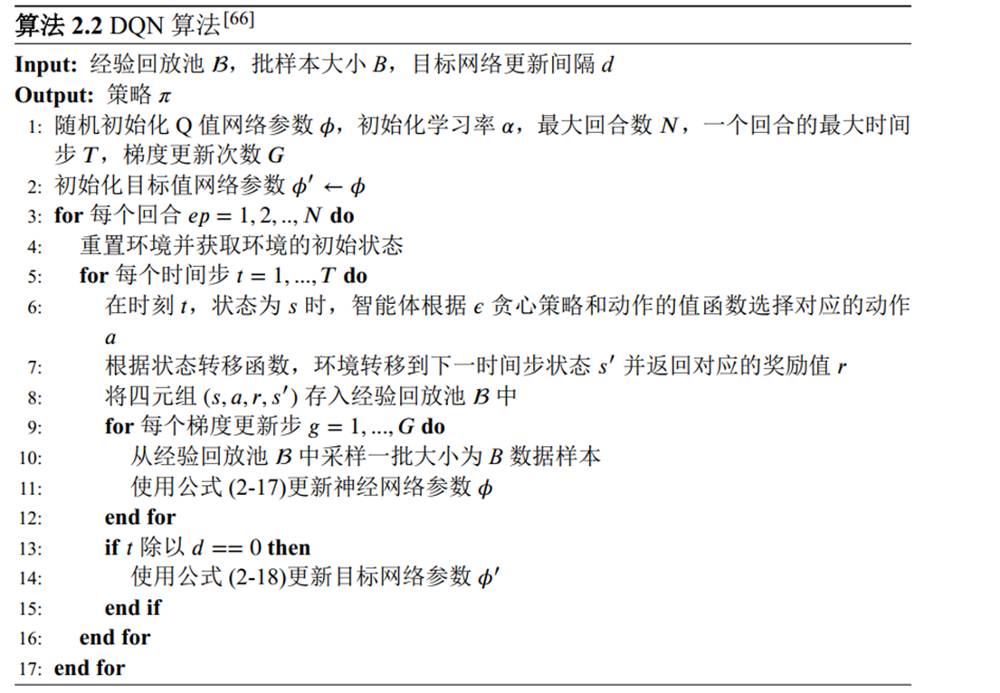
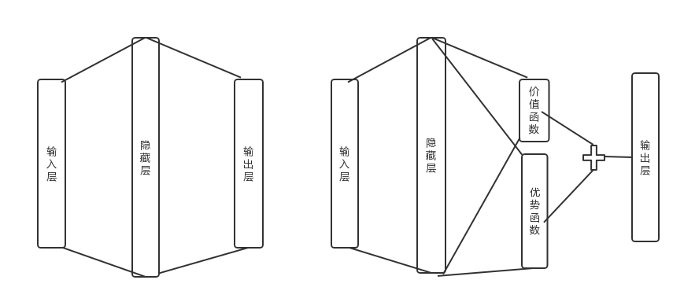
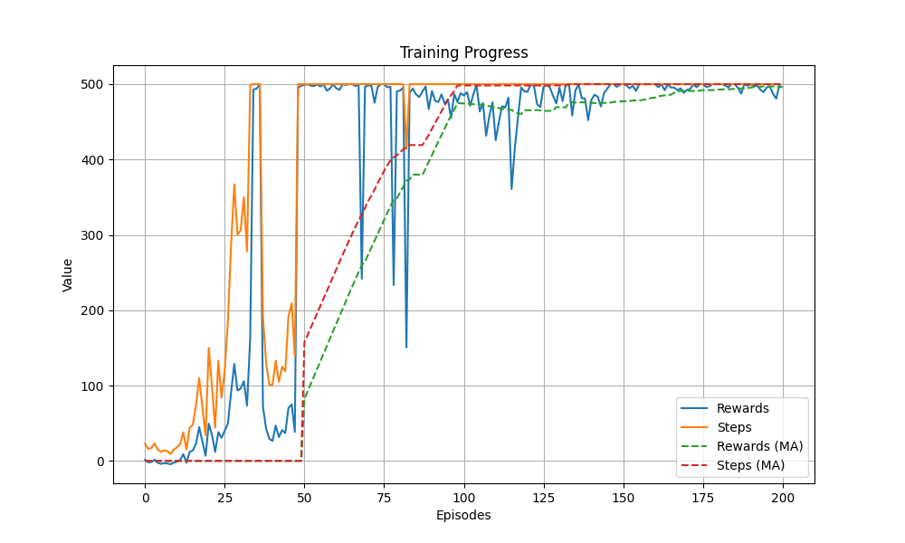

# 人工智能实验报告 实验六 深度强化学习
## 一、实验题目
在`CartPole-v1`环境中实现DQN算法。最终算法性能的评判标准：以算法收敛的reward大小、收敛所需的样本数量给分。 reward越高（至少是400，最大是500）、收敛所需样本数量越少，分数越高。
## 二、实验内容
### 1. 算法原理
Q-learning 算法是一种 value-based 的强化学习算法，Q 即为 Q(s,a)，在某一时刻的 state 状态下，采取动作 action 能够获得收益的期望。主要思想是将 state 和 action 构建一张 Q-table 表存储 Q 值，然后根据 Q 值选取能够获得最大收益的动作。基于 off-policy 时序差分法，且使用贝尔曼方程可以对马尔科夫过程求解最优策略。

每次更新对于状态 $s$ 和当前可选择的动作 $a$，观测下一时刻的状态 $s'$，可以通过某种策略得到动作回报 $r$，进而更新状态：$$Q(s,a):=Q(s,a)+\alpha[r+\gamma\max_{a'}Q(s',a')-Q(s,a)]$$
其中两个超参数 $\alpha$ 表示学习率，$\gamma$ 则表示折扣因子，表示未来奖励的重要性。

单纯的 Q-learning 无法胜任高维度、离散状态的任务，考虑引入神经网络拟合 $Q(s,a)$，并额外引入两个机制：经验回放和目标网络。经验回放通过构建经验池保存形如 $\langle s,a,s',r \rangle$ 的数据并从中随机采样训练，可以提升样本利用率；目标网络则保证监督数据在一定时间范围内保持稳定，降低当前 Q 值和目标 Q 值的相关性。DQN 还引入了 $\varepsilon$ 贪心策略，在前期优先探索获取经验，后期着重基于以往的经验以求快速收敛。


### 2. 优化
#### Double DQN
DQN 使用相同的 Q 网络来选择动作和评估该动作的价值，这导致估计的 Q 值系统性地高于真实值。由于强化学习的目标是最大化累积奖励，这种过估计会引导算法选择次优的策略。
$$Q(s,a):=Q(s,a)+\alpha[r+\gamma Q'(s',\arg \max_{a'}Q(s',a'))-Q(s,a)]$$
其中 $Q$ 表示评估网络，$Q'$ 表示目标网络。DDQN 使用评估网络选择动作，用目标网络计算价值。通过将动作选择和价值评估分离，理论上能降低了 Q 值过估计的程度，从而提高策略的稳定性。这是因为即使评估网络高估了某些动作的价值，目标网络也可能对其进行更准确的评估，从而减少了偏差。
#### Dueling DQN
Dueling 的思想是：$Q(s,a)$ 可以分解为 $V(s)+A(s,a)$，其中 $V(s)$ 是从该状态出发能够获得的最大累积分数，与动作 $a$ 无关，记作状态价值，$A(s,a)$ 是在该状态下进行动作 $a$ 的附加分数，记作优势价值。

大部分情况下，一个 episode 中的一个 step 选择什么 action 不会对结果产生决定性影响，即 $V(s)$ 是 $Q(s,a)$ 中的大头，而 $A(s,a)$ 的占比则较小。假如不分解出 $V(s)$，则对于每个动作 $a$，模型都需要重新学习状态价值，假如 $a$ 的数量比较多或学习次数不均衡，每个动作学习到的状态价值很可能有较大偏差。Dueling DQN 就是基于此将网络分为两部分：

这样的结构能保证状态价值的稳定性，从而加快收敛速度和泛化能力。

实现上通常会将 $A(s,a)$ 标准化，使其均值为 $0$，计算公式为：
$$Q(s,a)=V(s)+\left(A(s,a)-\frac{1}{|\mathcal A|}\sum_{a'}A(s,a')\right) $$
实测提升不大，可能是动作空间本来就很小，不存在偏差问题。
#### 延迟奖励与自定义 Reward
gym 提供的默认 reward 极度粗糙，默认情况下，每采取一步（包括终止步骤）都会获得 +1 的奖励。这种情况下很难让 AI 在短时间内快速学习到重要的知识。

考虑根据小车位置 pos 和杆子角度 ang 定义新的 reward，经过反复调参得到较优的组合公式为：$$r=\frac{1}{2}e^{-\frac{p}{2}}\cos^2{(a)}$$
其中 $$p=\begin{cases}0,&\left\vert{\mathrm{pos}}\right\vert<0.25 \\[4pt]\left\vert{\left\vert{\mathrm{pos}}\right\vert}-2.4\right\vert,&\text{others}\end{cases},\quad a=\begin{cases}0,&\left\vert{\mathrm{ang}}\right\vert<0.05 \\[4pt]\mathrm{ang},&\text{others}\end{cases}$$ 
 
这要求小车离中心点距离不超过 0.25，杆的角度不超过 0.05 才能获得最大奖励。

不难发现单次最大奖励 $r_{\max}=0.5$，这是因为在代码中，针对经验回放的奖励值进行了以下调整：
1. 每个 step 完成时不立刻将经验放入经验回放缓冲区，而是放入本 episode 的经验暂存区。
2. 如果 episode 未完成（step 未达到 500），则对最后的若干个 step 进行惩罚，降低其 reward。
3. 如果 episode 完成（step 达到 500），并且最后小车所在位置离中心点不超过 0.25，则对所有 step 进行奖励，使所有 step 的 reward 翻倍，这样总 reward 就能达到 500。
4. 最后将暂存区的经验放进总缓冲区。

优化来源于一系列比较显然的思考：
1. 中途暴死大概率不是最后一个 action 的错，要对中途的一系列错误决策进行惩罚
2. 坚持 500 个 step 也不是因为一部分 action 表现出色，而是整体 action 良好配合的结果。

延迟奖励和翻倍奖励的效果极为显著，但不会证明，但效果真的很好，但应该不是所有 RL 都能用这种策略。
## 三、关键代码
为了兼容最新版本的`numpy`，项目使用`gymnasium`库而非`gym`，理论上训练效果和`gym`相同，但代码似乎不能直接回迁`gym`。

### 模型结构
结构如上文 Dueling DQN 所述，实现上分为共享的特征提取层、价值流和优势流。
```python
class QNetwork(nn.Module):
  def __init__(self, input_size, hidden_size, output_size):
    super().__init__()

    self.feature_layer = nn.Sequential(
      nn.Linear(input_size, hidden_size),
      nn.ReLU(),
      nn.Linear(hidden_size, hidden_size),
      nn.ReLU(),
    )

    self.value_layer = nn.Sequential(
      nn.Linear(hidden_size, hidden_size // 2),
      nn.ReLU(),
      nn.Linear(hidden_size // 2, 1),
    )

    self.advantage_layer = nn.Sequential(
      nn.Linear(hidden_size, hidden_size // 2),
      nn.ReLU(),
      nn.Linear(hidden_size // 2, output_size),
    )

  def forward(self, inputs):
    x = self.feature_layer(inputs)
    value = self.value_layer(x)
    advantage = self.advantage_layer(x)
    q_values = value + (advantage - advantage.mean(dim=1, keepdim=True))
    return q_values
```
### 经验回放缓冲区
使用带有 maxlen 的 deque 作为 FIFO 队列，采样后使用 zip 将其转置得到 5 个向量化的数组，之后可以转为 tensor 进行计算。
```python
class ReplayBuffer:
  buffer: deque

  def __init__(self, buffer_size: int):
    self.buffer = deque(maxlen=buffer_size)

  def __len__(self):
    return len(self.buffer)

  def push(self, *transition):
    self.buffer.append(transition)

  def sample(self, batch_size: int):
    states, actions, rewards, next_states, dones = zip(*random.sample(self.buffer, batch_size))
    return np.array(states), actions, rewards, np.array(next_states), dones

  def clean(self):
    self.buffer.clear()
```
### 主训练流程
```python
for episodes in range(self.episodes):
  state, _ = self.env.reset(seed=random.randint(0, 2**31 - 1))
  self.env.action_space.seed(random.randint(0, 2**31 - 1))
  episode_steps = 0
  pos = 0
  ang = 0
  buf = []
  while True:
    action = self.select_action(state, test=False)
    next_state, _, terminated, truncated, _ = self.env.step(action)
    pos = next_state[0]
    ang = next_state[2]
    done = terminated or truncated

    # 自定义 reward
    reward = math.exp(-(0 if abs(pos) < 0.25 else abs(abs(pos) - 2.4)) / 2) * math.cos(0 if abs(ang) < 0.05 else ang) ** 2 / 2

    buf.append([state, action, reward, next_state, done])
    state = next_state
    self.steps_done += 1
    episode_steps += 1

    if len(self.memory) > self.batch_size:
      self.optimize_model()

    if (episodes + 1) % 10 == 0: # 录制
      self.record_frames.append(make_frame(self.env.render(), episodes + 1, episode_steps))

    if done:
      break
  if len(buf) != 500: # 惩罚
    for i in range(min(10, len(buf))):
      buf[-1 - i][2] = -0.5
  elif abs(pos) < 0.25: # 倍增奖励
    for i in buf:
      if abs(i[2] - 0.5) < 1e-6:
        i[2] *= 2
  episode_reward = sum(transition[2] for transition in buf)
  for transition in buf: # 推送到经验池
    self.memory.push(*transition)
  self.optimizer.step()
  self.scheduler.step()
  print(f'Episode {episodes + 1}: Total Reward: {episode_reward:.2f}, Steps: {episode_steps}')
  self.record_rewards.append(episode_reward)
  self.record_steps.append(episode_steps)
```

### 动作选择
```python
def select_action(self, observation: NDArray[np.float32], test=True) -> int:
  if not test and random.random() < self.eps:
    return self.env.action_space.sample()
  else:
    self.eval_net.eval()
    state = torch.tensor(observation, dtype=torch.float32).unsqueeze(0).to(self.device)
    with torch.no_grad():
      q_eval = self.eval_net(state)
    self.eval_net.train()
    return q_eval.argmax(dim=1).item()
```

### 经验回放与模型优化
注意`q_eval`和`q_target`计算方式的区别：终止状态不存在 reward，因此需要用掩码`1 - dones`进行区分。

目标网络使用硬更新策略，即每`update_freq`个 step 将评估网络的参数复制到目标网络。
```python
def optimize_model(self):
  assert len(self.memory) >= self.batch_size

  states, actions, rewards, next_states, dones = self.memory.sample(self.batch_size)

  states = torch.tensor(states, dtype=torch.float32).to(self.device)
  actions = torch.tensor(actions, dtype=torch.long).unsqueeze(1).to(self.device)
  rewards = torch.tensor(rewards, dtype=torch.float32).unsqueeze(1).to(self.device)
  next_states = torch.tensor(next_states, dtype=torch.float32).to(self.device)
  dones = torch.tensor(dones, dtype=torch.float32).unsqueeze(1).to(self.device)

  q_eval = self.eval_net(states).gather(1, actions)

  with torch.no_grad(): # DDQN
    next_actions = self.eval_net(next_states).argmax(dim=1, keepdim=True)
    q_target = self.target_net(next_states).gather(1, next_actions)
    q_target = rewards + self.gamma * q_target * (1 - dones)

  loss = self.criterion(q_eval, q_target)

  self.optimizer.zero_grad()
  loss.backward()
  torch.nn.utils.clip_grad_value_(self.eval_net.parameters(), self.grad_norm_clip)
  self.optimizer.step()

  if self.steps_done % self.update_freq == 0: # 硬更新
    self.target_net.load_state_dict(self.eval_net.state_dict())

  # epsilon 衰减
  self.eps = self.eps_end + math.exp(-(self.steps_done / self.eps_decay)) * (self.eps_start - self.eps_end)
```
### 测试
```python
total_rewards = 0
state, _ = self.env.reset()
done = False
episode_steps = 0
while not done:
  action = self.select_action(state, test=True)
  next_state, reward, terminated, truncated, _ = self.env.step(action)
  done = terminated or truncated
  state = next_state
  total_rewards += float(reward)
  episode_steps += 1
  self.record_frames.append(make_frame(self.env.render(), 1, episode_steps))
print(f'Test Episode: Total Reward: {total_rewards}, Steps: {episode_steps}')
```
## 四、实验结果
以下是 200 个 episode 内模型的训练曲线：


其中虚线是对应实线的滑动平均，窗口大小为 50。

观察曲线可知模型在 50 个 episode 后即可保证 500 个 step 内小车不倒且不冲出场地，在 150 个 episode 后可稳定在原地保持几乎完全直立而没有大幅度抖动。

训练结束后保存模型并测试，结果为：
```
Test Episode: Total Reward: 500.0, Steps: 500
```

自定义 reward 使得 reward 达到 500 的条件极为苛刻（可能随机的初始状态就不满足 reward 为满的条件），评分时最好以 step 为准。

为了尽早收敛设置了较大学习率，训练过程中可能会中途跑崩（或许需要换一个种子？）

不想对比无 DDQN 或无 Dueling DQN 的曲线，因为需要反复调参。

训练视频、测试视频、模型权重见附件。视频经过二次压制。
## 五、参考材料
1. DQN： https://pytorch.ac.cn/tutorials/intermediate/reinforcement_q_learning.html
2. DDQN： https://www.cnblogs.com/pinard/p/9778063.html
3. Dueling DQN： https://www.cnblogs.com/pinard/p/9923859.html